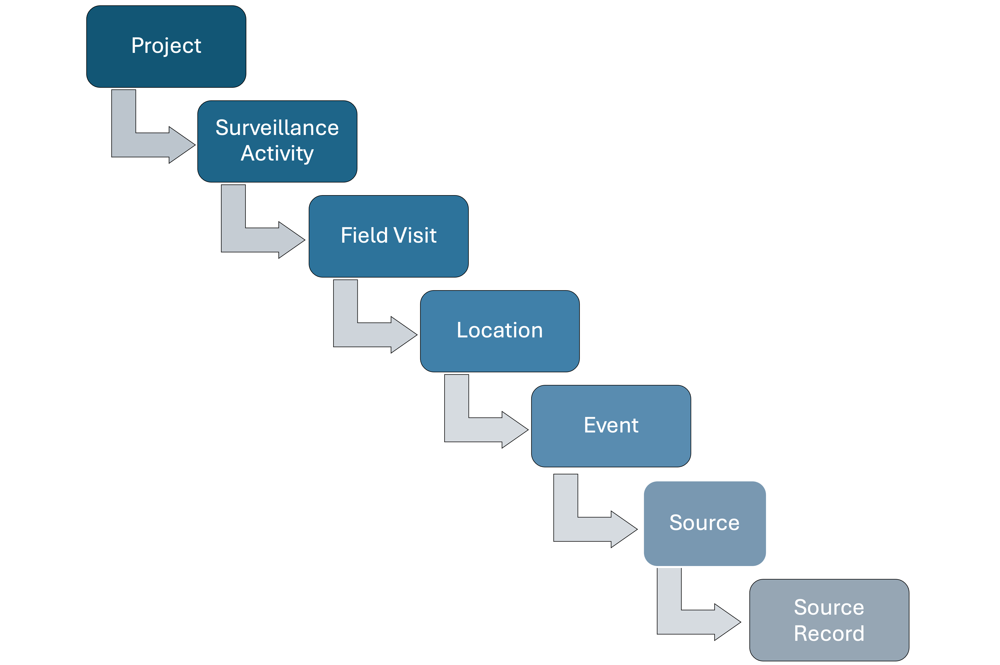
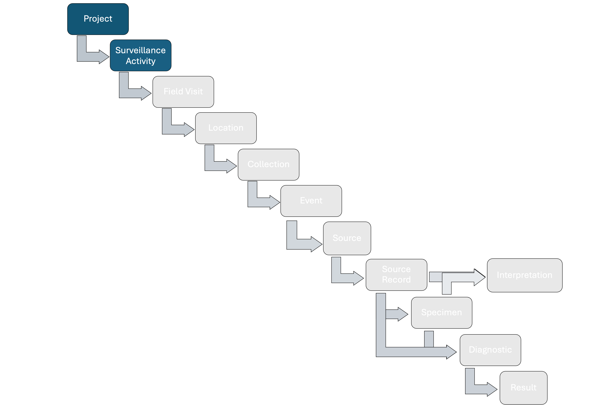
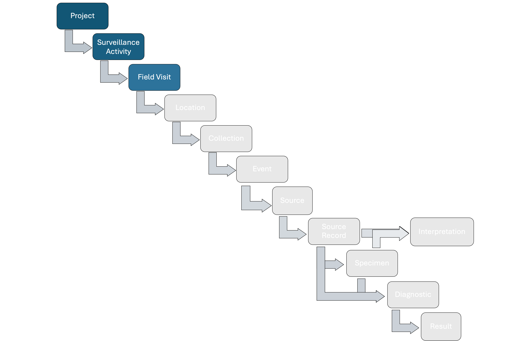
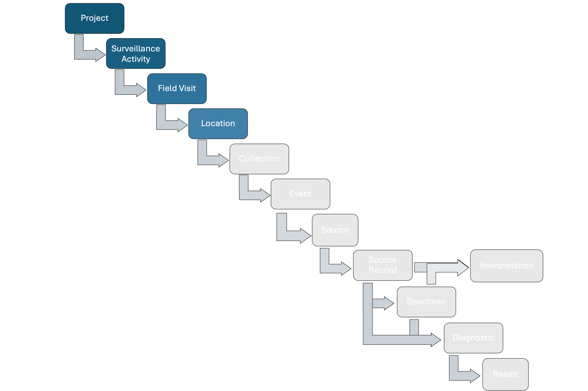
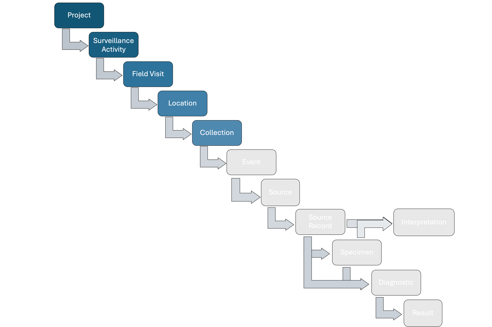
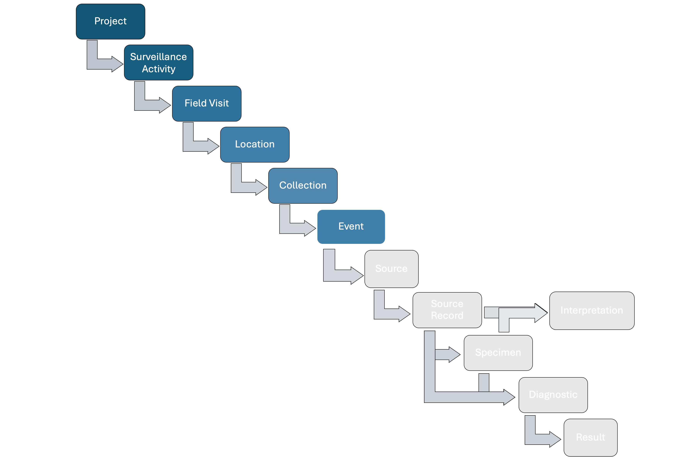
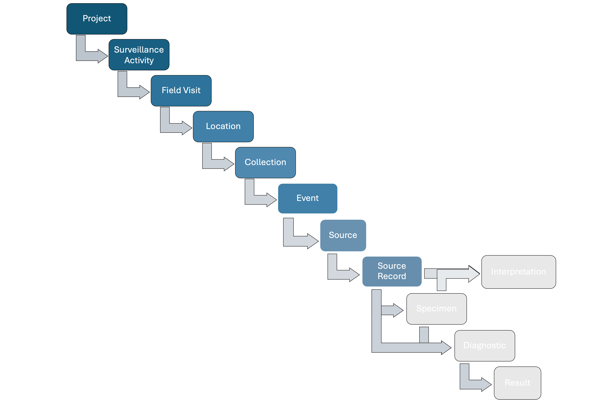
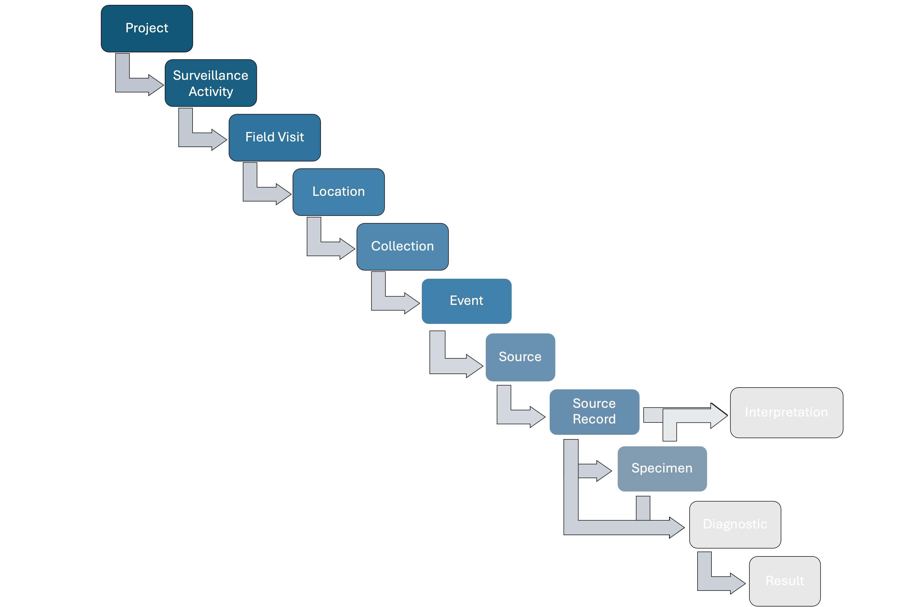
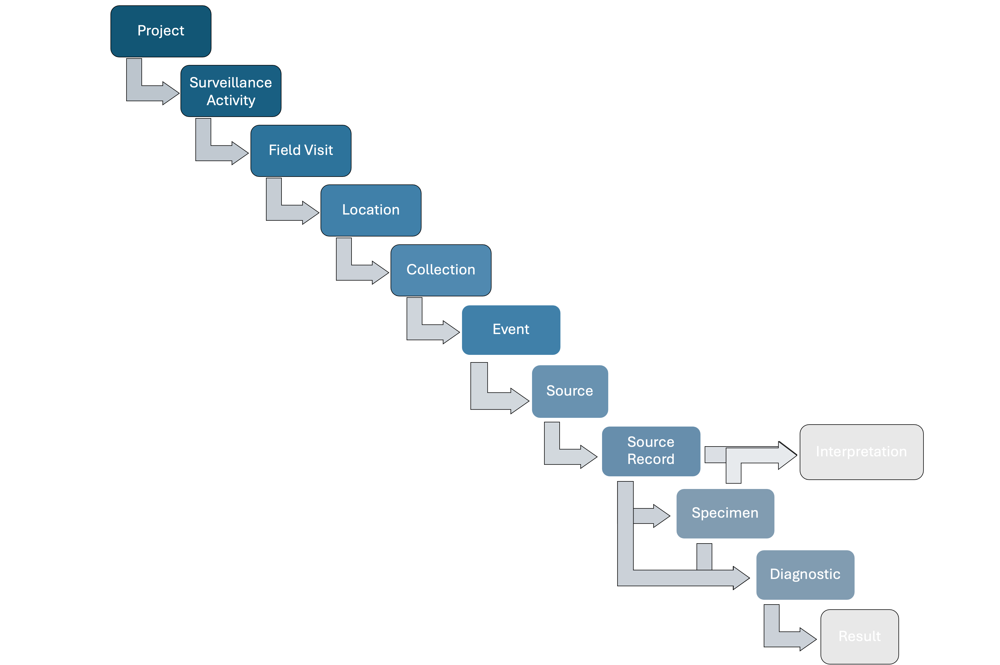
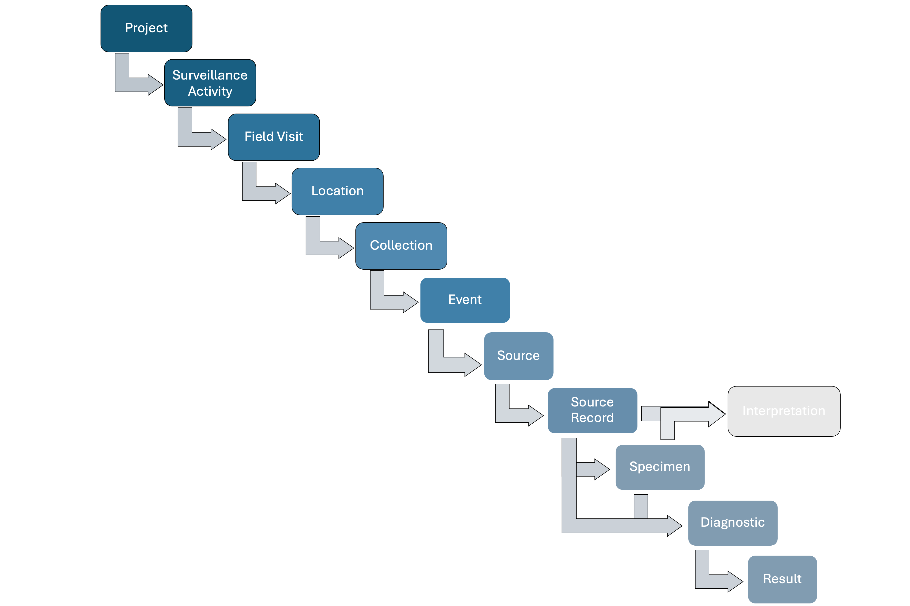

# Data Model {.unnumbered}

```{r, echo=FALSE}

htmltools::div(
  htmltools::a(
    href = "https://www.whin.org", target = "_blank",
    htmltools::img(src = knitr::image_uri("Pictures_and_diagrams/WHINlogo.png"),
                   alt = 'WHIN logo',  
                   style = "position: fixed; right: 10px; top: 0%; width: 220px;")
  ),
  htmltools::a(
    href = "https://www.wcs.org", target = "_blank",
    htmltools::img(src = knitr::image_uri("Pictures_and_diagrams/WCS_LOGOTYPE.png"),
                   alt = 'WCS logo',  
                   style = "position: fixed; right: 10px; top: 13%; width: 200px;")
  ),
  htmltools::a(
    href = "https://www.iucn.org/our-union/commissions/world-commission-protected-areas", target = "_blank",
    htmltools::img(src = knitr::image_uri("Pictures_and_diagrams/wcpa-logo.png"),
                   alt = 'WCPA logo',  
                   style = "position: fixed; right: 10px; top: 20%; width: 200px;")
  ),
  htmltools::a(
    href = "https://snappartnership.net/", target = "_blank",
    htmltools::img(src = knitr::image_uri("Pictures_and_diagrams/snapp-logo-250.png"),
                   alt = 'SNAPP logo',  
                   style = "position: fixed; right: 0px; top: 40%; width: 200px; background-color: black;")
  )
)

```


## Introduction

HAWK's **data model** is designed to accommodate wildlife, arthropod, and environmental health data from various sources, including local to national wildlife health surveillance systems, research initiatives, citizen-science based projects, or any other source of wildlife health information. We strongly recommend first learning about the core components of the data model: *Project* to *Results*, and *Interpretation*.

HAWK structures surveillance data following a hierarchy, capturing relevant epidemiological information at each step. The full hierarchy includes:

1. **Project**: A planned set surveillance operations with specific goals or a common topic, usually with a defined scope and set of tasks with a common leader and organizer (e.g., a national wildlife health surveillance system).
2. **Surveillance Activity**: Specific surveillance goal and methodology (who, where, when, what, why, how) documented following a standard metadata format.
3. **Field Visit**: A recorded interval during which fieldwork or data collection are conducted.
4. **Location**: Areas where activities are conducted.
5. **Area Effort**, **Track Effort**, and **Point Effort**: Units of effort associated with the collection of **Events** (see below) in a determined area (e.g., Events in a sector within protected area) along in a linear feature (e.g., Events in transect or ranger patrol track), or at spatial point (e.g., a set of mist nests placed during a specific period of time for a sampling Event), respectively. 
6. **Event**: Point epidemiological unit with a spatiotemporal coordinate (longitude and latitude) where wildlife health surveillance data are collected from.
8. **Source**: An observed, diagnosed, or sampled entity to assess their health status or health hazard presence. There are four Source types:​
      * *Group*: more than one individual of the same taxa
      * *Animal*: one individual
      * *Environmental*: a site where measurements on environmental properties are made or samples are collected from (e.g., ponds or feces in the field)
      * *Arthropod*: the population of arthropods at a site
9. **Source Record**: A record of a *Source* at a specific time *t*.
10. **Specimen**: A sample taken from a *Source*.
11. **Diagnostic**: A test conducted on a *Source* or collected *Specimen* to assess health metrics.
12. **Result**: The outcome of a *Diagnostic* for a specific health metric and the corresponding interpretation.
12. **Interpretation**: The final status assigned to a *Specimen* or *Source Record* following documented case definitions.
 
**The main relationships among the basic units of the data model** are shown in Figure 1 below:


{width=100%}

**Figure 1**: Basic relationships among the basic units of the data model.

HAWK employs a modular approach to the data model, enabling components to be added based on specific user needs. 

::: {.callout-note title="Case Study 1"}
When data comes from wildlife mortality reported by a community member through a mobile application:

The Surveillance Activity contains a description of the methodology

The Field Visit could be a day when the mortality was found

The Location could be the site where the mortality was found

An Event is the epidemiological unit with latitude, longitude, and time representing the position 
where dead animals were found

The Animal Source Records describe the dead animals

No Specimens, Diagnostics, or Results data are generated

No Effort is involved as the animals are found opportunistically


{width=100%}

**Figure Case Study 1**: An illustration  of how case study 1 data is structured in the data model.

:::

This flexible structure means the model remains efficient and scalable, adapting to different users and surveillance needs.

<!-- The next example is a series of surveys in wildlife farms to identify pathogens. Surveys are conducted every 3 months and each one of them include all the farms in the study. The farms are distributed in several counties. Each farm has several species that are distributed in barns, aisles, pens, and cages. Seasonal changes are assessed as well. All the animals of the cages will be sampled (rectal and oral swab each one). Fecal samples will be collected from the cages directly as well. Finally, each sample will be tested for 3 pathogens. In this example, there could be a single Surveillance Activity with the three pathogens included, or three Surveillance Activities with the same methods except the targeted hazards (one Surveillance Activity per pathogen is recommended). The data includes **Field Visits every three months**. Each one of these Field Visits includes all the counties were the farms are located. If each farm is a Location, then the Locations must be clustered by county. Also, if the Event within each farm is a cage with animals, then the Events must be clustered by pen, aisles, and barns. In the manner the structure of the data is Field Visit, county (cluster), farms (Location), barns (cluster), aisles (cluster), pens (cluster), and cages (Event). Depending on the number of cages per pen, there could be multiple or a unique Event per pen. Each Event will have as many Sources at time *t* as animals are per each cage. Continuing with the animals (Sources), two Specimens are collected from each one of them and they are tested for three pathogens for a total of six tests per individual. Furthermore, each cage Event also has a Group Source Record, corresponding to the animals that are in the cage as a group. This Group Source Record has a fecal Specimen associated also tested for three pathogens. -->

<!-- # Figure first exaple -->

<!-- The data model is **not designed for wildlife population monitoring**. However, it includes key identifiers that enable integration of wildlife health and population data. -->


# Main Units of the Data Model

## Project

```{r child="project.qmd" , echo=FALSE, eval=T, message=FALSE, cache=F}

```

## Surveillance Activity 

{width=100%}
**Figure 2**: Postition of Surveillance Activity in the data model.

```{r child="surveillance_objective.qmd" , echo=FALSE, eval=T, message=FALSE, cache=F}

```


## Field Visit

{width=100%}
**Figure 3**: Position of Field Visit in the data model.

```{r child="field_activity.qmd", echo=FALSE, eval=T, message=FALSE, cache=F}

```

## Location

{width=100%}
**Figure 4**: Position of Location in the data model.

```{r child="location.qmd", echo=FALSE, eval=T, message=FALSE, cache=F}

```

## Effort

In the data model, **Effort** contains the information associated with the spatial and temporal metrics used to activel obtain **Sources** in the field. 

When **Source Records** are not linked to an **Effort** (e.g., opportunist finding of dead animals), then no **Effort** is involved.

{width=100%}
**Figure 5**: Position of Effort in the data model.

### Area Effort
```{r child="collection_area.qmd", echo=FALSE, eval=T, message=FALSE, cache=F}

```

### Track Effort

```{r child="collection_track.qmd", echo=FALSE, eval=T, message=FALSE, cache=F}

```

### Point Effort

```{r child="collections.qmd", echo=FALSE, eval=T, message=FALSE, cache=F}

```

**Area, Track and Point Effort** fields also help capture issues encountered when searching for **Sources**, such as camera traps running out of power, being stolen, or damaged mist nets. 

**Efforts** can contain between zero (e.g., an unsuccessful capture where no animals are caught) and an unlimited number of Source Records**.

## Event

{width=100%}
**Figure 6**: Position of Event in the data model. 

```{r child="incident.qmd", echo=FALSE, eval=T, message=FALSE, cache=F}

```


## Source and Source Records

{width=100%}
**Figure 8**: Position of Source Records in the data model. 

```{r child="source_source_records.qmd", echo=FALSE, eval=T, message=FALSE, cache=F}

```

## Specimen

{width=100%}
**Figure 13**: Position of Specimens in the data model. 

```{r child="specimen.qmd", echo=FALSE, eval=T, message=FALSE, cache=F}

```

## Diagnostic

{width=100%}
**Figure 14**: Position of Diagnostic in the data model. 

```{r child="diagnostics.qmd", echo=FALSE, eval=T, message=FALSE, cache=F}

```

<!-- ## Diagnosis -->

<!-- {width=100%} -->

```{r child="diagnosis.qmd", echo=FALSE, eval=F, message=FALSE, cache=F}

```

## Result

{width=100%}
**Figure 15**: Position of Result in the data model. 

A **Result** request information on the **Diagnostic** outcome for a single target, in quantitative or qualitative units. A **Result** can be more specific, reporting the outcome with respect to a gene of a specific pathogen that the **Diagnostic** can detect. For example, a real-time PCR can target the detection of Influenza A nucleic acid by the amplification of genes X and Z. The **Result** reports the Ct value for the amplification of either gene X or Z of Influenza A viruses. 

Key attributes of a **Result** include:

* Target Name
* Unit
* Result
* Interpretation

Other attributes are provided in the [Data Dictionary](https://dmontecino.github.io/WH_Database/data_dictionary.html) (under construction)

The **Result** of a **Diagnostic** can be interpreted as positive, negative, or undetermined, based on the case definition for the parent diagnostic test (reported in the **Surveillance Activity** metadata).

## Storage

A **Storage** indicates the facility where carcasses of **Group Source Records**, the carcass of an **Animal Source** or **Specimens** are stored. The storage position can be as specific as the exact row of a cryo box in which a vial containing a **Specimen** is located. 

Key attributes of a **Storage** include:

* Quantity stored
* Quantity unit
* Storage type
* Facility
* Building 
* Room
* Storage Unit
* Storage problems

Other attributes are provided in the [Data Dictionary](https://dmontecino.github.io/WH_Database/data_dictionary.html) (under construction)

Multiple **Storage** units can be added for each **Source** or **Specimen**. In the case of **Specimens**, the recorded **Storage** units allow to track the current amount available versus the original amount and the reason of the differences over time.


## Shipment

A **Shipment** indicates the movement of carcasses of **Group Source Records**, the carcass of an **Animal Source** or **Specimens** across facilities.  

<!-- In the data model, **Specimens** from all Sources (including Diagnostic Products) and carcasses of **Group and Animal Sources** can be shipped to another facility. Partial amounts can also be shipped and the volume exported can be tracked as well as the remaining amounts of the original **Specimen** left at the storage site. Shipments that are currently "in transit" can also be tracked. -->

Key attributes of a **Shipment** include:

* Quantity shipped
* Quantity unit
* Origin
* Destination
* Storage method during shipment
* Status

Other attributes are provided in the [Data Dictionary](https://dmontecino.github.io/WH_Database/data_dictionary.html) (under construction)


<!-- ## Laboratories -->

<!-- The data model includes **Laboratory** entities. Laboratories can conduct **Diagnostics** to test for hazards. Laboratory properties include address, manager, name, Laboratory ID, among others (Data Dictionary). It is also possible to store data regarding laboratory capabilities in terms of diagnostic tests and storage, and their certifications (Bio safety levels, etc.) -->

## Interpretation

### Interpretation of Specimens

In the data model, a **Specimen** can receive an **Interpretation** with respect to the hazards targeted in the corresponding **Surveillance Activity** based on a case definition for a positive, negative, or undetermined **Specimen** provided in the **Surveillance Activity** metadata. The **Interpretation** follows the **Results** from the **Diagnostics** conducted using the **Specimen** and their  interpretations.

**Specimens** can receive multiple **Interpretations** if they are used in several **Diagnostics** targeting different hazards.

::: {.callout-note title="Case Study 12"}
The presence of a single target (e.g., SARS-CoV-2) is assessed in a **Specimen** using three different **Diagnostics**. The first and second **Diagnostic** are positive, whilst the **Result** for the third **Diagnostic** is negative. Based on these mixed **Results**, the SARS-CoV-2 status of the **Specimen** must be interpreted (positive, negative, inconclusive).
::: 


### Interpretation of Source Records

In the data model, a **Source Record** can receive an **Interpretation** with respect to the hazards targeted in the corresponding **Surveillance Activity** based on a case definition for a positive, negative, or undetermined **Source Record** provided in the **Surveillance Activity** metadata. An **Interpretation** for a **Source Record** depends on the field findings, **Interpretations** for the **Specimens** of the corresponding **Source Record**, **Results** of **Diagnostics** conducted with the **Source Records** (for **Group Source Records** and **Animal Source Records**) and **Necropsy** findings (for **Animal Source Records**).

A **Source Record** can receive multiple **Interpretations** depending on the hazards targeted.


<!-- In the data model, a **Source Record** can receive an **Interpretation** with respect to the hazards targeted in the corresponding **Surveillance Activity** based on a case definition for a positive, negative, or undetermined **Source Record** provided in the **Surveillance Activity** metadata. The **Interpretation** for a specific hazard follows the **Results** and **Interpretations** of the **Diagnostics** conducted using **Specimens** of the **Source Records** and the **Interpretation** of the **Source Records**.  -->

::: {.callout-note title="Case Study 13"}
The presence of a single target (e.g., Foot and mouth disease virus) is assessed in an **Animal Source Record** using three different **Diagnostics** completed with one **Specimen** and the results of a **Necropsy**. The **Results** for the first and second **Diagnostic** are positive, whilst the **Result** for the third **Diagnostic** is negative. The **Interpretation** for the **Specimen** is "posiive". Moreover, the **Necropsy** do not reveal any important lesions. Based on these **Results**, the Foot and mouth disease virus status of the **Animal Source Record** must be interpreted (positive, negative, inconclusive).
::: 

Key attributes of a **Interpretation** include:

* Quantity shipped
* Quantity unit
* Origin
* Destination
* Storage method during shipment
* Status

Other attributes are provided in the [Data Dictionary](https://dmontecino.github.io/WH_Database/data_dictionary.html) (under construction)

<!-- For example, it is possible that a single hazard is assessed in multiple  **Specimens** of a **Source Record** using three different **Diagnostics**. Two of these **Specimens** are interpreted as positive and the other one as negative. Based on these data, the hazard status of the **Source Record** must be interpreted (positive, negative, inconclusive). -->

<!-- **Source Record** can receive multiple **Interpretations** if multiple hazards are assessed in them.  -->

# Complexities

```{r child="groups.qmd", echo=FALSE, eval=T, message=FALSE, cache=F}

```


```{r child="complexities_surv_act.qmd", echo=FALSE, eval=F, message=FALSE, cache=F}

```


```{r child="standardized_recommendations.qmd", echo=FALSE, eval=F, message=FALSE, cache=F}

```