# General User Manual {.unnumbered}

```{r, echo=FALSE}
# htmltools::img(src = knitr::image_uri("Pictures_and_diagrams/WCS_LOGOTYPE.png"), 
#                alt = 'logo', 
#                style = 'position:fixed; 
#                         top:0;
#                         right:0; 
#                         padding:70px;',
#                width = "300px", 
#                heigth = "300px")
# 
# 
# htmltools::img(src = knitr::image_uri("Pictures_and_diagrams/wcpa-logo.png"), 
#                alt = 'logo', 
#                style = 'position:fixed; 
#                         top:90;
#                         right:0; 
#                         padding:70px;',
#                width = "300px", 
#                heigth = "300px")

htmltools::div(
  htmltools::a(
    href = "https://www.whin.org", target = "_blank",
    htmltools::img(src = knitr::image_uri("Pictures_and_diagrams/WHINlogo.png"),
                   alt = 'WHIN logo',  
                   style = "position: fixed; right: 10px; top: 0%; width: 220px;")
  ),
  htmltools::a(
    href = "https://www.wcs.org", target = "_blank",
    htmltools::img(src = knitr::image_uri("Pictures_and_diagrams/WCS_LOGOTYPE.png"),
                   alt = 'WCS logo',  
                   style = "position: fixed; right: 10px; top: 13%; width: 200px;")
  ),
  htmltools::a(
    href = "https://www.iucn.org/our-union/commissions/world-commission-protected-areas", target = "_blank",
    htmltools::img(src = knitr::image_uri("Pictures_and_diagrams/wcpa-logo.png"),
                   alt = 'WCPA logo',  
                   style = "position: fixed; right: 10px; top: 20%; width: 200px;")
  ),
  htmltools::a(
    href = "https://snappartnership.net/", target = "_blank",
    htmltools::img(src = knitr::image_uri("Pictures_and_diagrams/snapp-logo-250.png"),
                   alt = 'SNAPP logo',  
                   style = "position: fixed; right: 0px; top: 40%; width: 200px; background-color: black;")
  )
)
```

**HAWK** stands for **Health and Wildlife Knowledge** database, and it is a user-friendly web-based database designed to manage wildlife health data. Data in HAWK are structured following a versatile data model created by the Data Task Force within the **Wildlife Health Intelligence Network** (WHIN), a global community of practice for growing wildlife health surveillance. HAWK can effectively manage data generated by wildlife health surveillance systems, research, and public initiatives under one structure. Examples include typical morbidity/mortality investigations, opportunistic findings such as reports of dead animals by the public or in social media; testing of samples from captured, marked, and recaptured animals; multilevel study designs; and transect survey observations among others. HAWK is developed and maintained by Wildlife Conservation Society’s Health and Conservation Technology Programs, based in Bronx, New York, United States.

In this manual, we Capitalize and bold nouns such as **Projects**, **Surveillance Activities**, **Field Visits**, **Locations**, **Collections**, **Events**, **Sources**, and **Specimens** when they refer to specific HAWK data units.

**This manual focuses on general user functions. To learn more about administrator account, refer to the “HAWK Administrator Account Manual”** (*under construction*).

If a specific section or explanation is missing in this manual, plese contact dmontecino@wcs.org

# Structure of the health data in HAWK and data units

This manual provides a summary of the data structure in HAWK For a full description, visit the website describing the data model [link](https://dmontecino.github.io/WH_Database/data_model.html). Briefly, HAWK has “data units”: **Project**, **Surveillance Activity**, **Field Visit**, **Location**, **Collection**, **Event**, **Source**, **Source Record**, **Specimen**, **Diagnostic**, **Result**, **Interpretation**, **Necropsy**, **Shipment**, and **Storage**. **Projects** identify a specific **Project** leader and information. Under **Projects** are **Surveillance Activities** that are executed following a methodology documented in a standard metadata format. **Surveillance Activities** are conducted through **Field Visits** that encompass a period during which **Locations** (i.e. study sites) are surveyed. These **Locations** contain **Events**, epidemiological units with a spatiotemporal coordinate that can contain four types of **Sources**: group of animals of the same taxon (*Group*), individual animals (*Animal*), arthropods population at a site (*Arthropod*), or a site where environmental measurements or specimens can be sampled from (i.e., water or feces; *Environmental*). **Sources** at time *t* are **Source Records**. The **Events** can be found, observed, or accomplished through a **Collection** that involves an effort to obtain data.

Units in HAWK can be grouped in temporal and spatial clusters when needed using *tags*. What a **Location**, **Event**, and other data units represent must be documented and consistently applied within each **Surveillance Activity**.

The four types of **Sources** can provide **Specimens** cross-sectionally or longitudinally. **Necropsy** of animal carcasses can be documented. Live or dead **Group Source Records**, **Animal Source Records**, **Environmental Source Records**, and **Specimens** can be tested for health metircs using **Diagnostics** i.e. pathogens, fracture, heavy metals, or cardiomegaly. **Diagnostics** can be conducted in a **Laboratory** or in the field. Each **Diagnostic** can have one or multiple **Results** (one per health metric). **Results**, **Specimens**, and **Sources** receive an **Interpretation** for health metrics measured following documented case definitions. The data model also supports the administration of **Specimens** or carcass storage or and shipments.

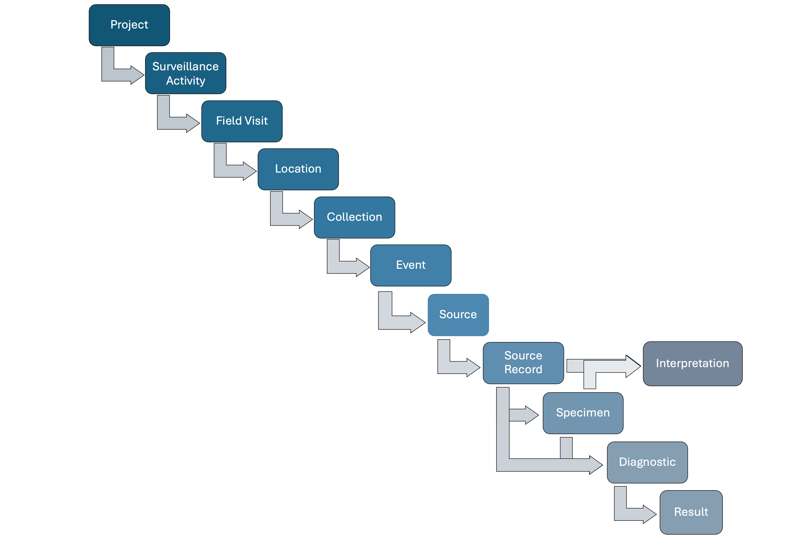{width=80%, fig-align="center"}


<!-- Depending on the study design, **Surveillance Activities** may only contain **Field Visits** up to **Events** (i.e. observation of a site with pollution without sample **Collection** and animal morbidity and mortality) or up to **Source Records** only (i.e. mortality observations). It is also possible that a **Surveillance Activity** contains **Specimens** and **Diagnostics** only or **Source Records**, **Specimens**, and **Diagnostics** only. In the first case, stored **Specimens** collected under a previous **Surveillance Activity** are used in a second **Surveillance Activity** and tested for health hazards. In the second case, a stored carcass collected under a previous **Surveillance Activity** generates new **Specimens** that are tested for health hazards. -->

<!-- The data structure allows for cases when **Field Visits** or **Locations** end without any **Event**; **Events**, **Collections**, and **Sources** end without any **Source Record**; **Source Records** end up without any **Specimen**; **Specimens** end up without any **Diagnostics**; and **Diagnostics** end up without an **Interpretation**. -->

For a detailed explanations of the data units visit the HAWK data model manual [link](https://dmontecino.github.io/WH_Database/data_model.html#surveillance-activities).

We encourage a modular approach for each system implementing HAWK, starting with the foundational frame and only adding additional components as needed.

# Account Types

HAWK has four types of accounts: **General Administration**, **Organization Administrator**, and **General User**.

## General Administrator Account (*under construction*)

These accounts are assigned internally by the Wildlife Conservation Society. There are two **General Administrators** (see HAWK website [*under construction*] to learn more). **General Administrators** support the maintenance of the database across all accounts linked to at least one **Organization** (see below), they authorize the creation of **Organization** accounts (see next), establish **Organization Administrators** based on requests (see below), and communicate with **Organization Administrators** to solve technical issues, report updates and bugs, etc.

## Organization Account

The first step to begin using HAWK is to request an **Organization** account. **Organization** accounts contain as many **Projects** as needed, and they can only be accessed by authorized **Organization Administrators** and **General Users**. **Organization** accounts manage data for their **Surveillance Activities**.

## Organization Administrator (*under construction*)

**Organization Administrators** can view, edit, delete, and export all data controlled by the corresponding **Organization** (all data across all **Organization Projects**). **Organization Administrators** can accept or reject **General Users** (see below) under the corresponding Organization. **Organization Administrators** can assign General User different data permissions (i.e. view, edit, delete, export) from **Projects** to **Interpretations** per **Surveillance Activity** within the **Organization** account. **Organization Administrators** can also modify these permissions, authorize the creation of new **Projects** under the corresponding **Organization** account, communicate with **General Administrators**, restore deleted data (see below), and access data changes logs (see below). Two **Organization Administrators** per Organization account are accepted. For more details see “HAWK Administrator Account Manual” (*under construction*).

## General User (*under construction*)

General User accounts belong to specific individuals. **General Users** are granted data view, edit, delete, and export permissions from **Projects** to **Interpretations** per **Surveillance Activity** within the **Organization**, by **Organization Administrators**. **General Users** can also receive “Project Creation” permissions. Therefore, **General Users** can be granted data viewing permissions for **Surveillance Activity** 1 in **Project** A; export permissions for **Surveillance Activity** 2 in **Project** A; no access to **Project** B data; and have edit data permissions for all **Surveillance Activities** in **Project** C.

**General Users** must be granted access to an **Organization**; however, the same **General User** can be accepted in several **Organizations** and be upgraded to **Organization Administrator** by current **Organization Administrators**.

# Creating and Modifying Accounts (*under construction*)

## Organization Account

**General Administrators** review new **Organization** requests. To request a new **Organization**, a representative or individual completes the ‘Organization request form’ (*under construction*) which includes contact information for an **Organization Administrator**. The representative or individual requesting the **Organization** account will be contacted via email as soon as possible. Once created the **Organization Administrator** listed in the request form takes control of the **Organization** account.

***HAWK is designed to remain accessible and sustainable as a public good to encourage widespread use. Critically, when local funding is unavailable, Global South users will be accommodated at no charge, subject to reasonable usage limits. Global South users with funding are encouraged to share their capacity to support database maintenance and ensure the long-term use and storage of data.***

## Organization Administrator Account

These accounts are established by **General Administrators** based on petitions made by the Organization representative or individual requesting the new Organization Account (see above). **General Users** with access to the corresponding Organization can be upgraded to **Organization Administrators**by existing Organization Administrators. **Organization Administrators**can also be converted to **General Users**.

Instructions to convert an **Organization Administrator** to a **General User** are given in “**HAWK Administrator Account Manual**” (*under construction*).

## General User Account

To create a new **General User** for a specific **Organization**, the individual interested in having a **General User** account completes the “Insert title of form (*under construction*)”. Once the form is submitted, the individual receives an email with the subject, “HAWK Organization Access Request Confirmation”. The request is reviewed by the corresponding **Organization Administrator**. Once approved by the **Administrator**, the new **General User** will receive a second email with the subject, “Your Access to the [**Organization** name] HAWK Account Has Been Accepted”. This second email confirms the account is ready to be used.

**General Users** can be authorized to access other **Organizations**. To obtain access authorization to other **Organizations**, **General Users** must follow these steps (*under construction*):

**General User** access and permission to each **Organization** are set by the respective **Organization Administrators**.

Instructions to upgrade a **General User** to an **Organization Administrator** are provided in the “**HAWK Administrator Account Manual**” (*under construction*).

# General Users Navigating HAWK

## Logging in to the Web-based User Interface (*under construction*)

**Organization Administrators**and approved **General Users** access HAWK by opening this [link](https://wildlifehealthintelligence.net/login) on a Chrome web browser and providing their username and password. HAWK software is optimized for Chrome and may not work on other browsers:

## Initial Screen

Once successfully logged on, the Graphical User Interface (GUI) appears. The GUI has two panels that are **always available**. On the left side of the screen is the **Navigation Panel** (red frame in the image below). On the right side is the Workspace (green frame in the image below):

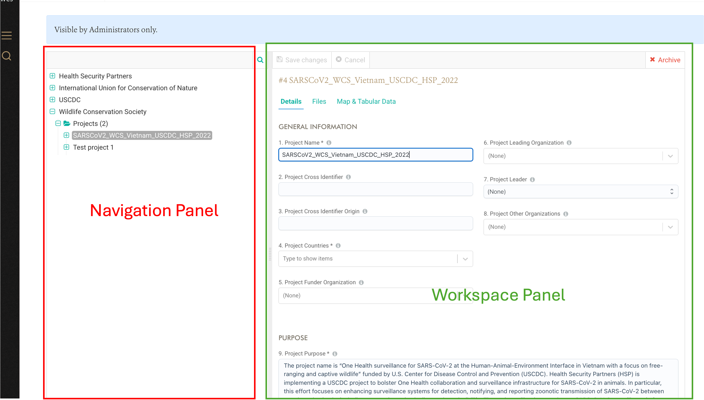{width=100%, fig-align="center"}


The **Navigation Panel** shows all the Organizations that a user has access to. The relative size of the **Navigation** and **Workspace Panels** can be adjusted by selecting the divider bar separating the two panels (red frame in the figure below) and dragging it to the left or right. Compare the two images below:

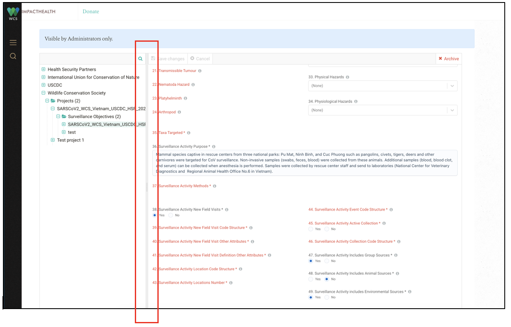{width=100%}

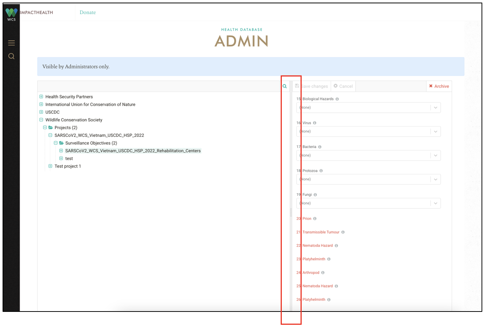{width=100%}


Horizontal and vertical scroll bars appear to aid independent navigation of the **Navigation** and **Workspace Panels**.

## The Navigation Panel

The **Navigation Panel** has a tree hierarchy. This tree begins with a display of the **Organizations** to which an individual has access. Within, each Organization has a **Projects** folder that contains the **Projects** belonging to the corresponding **Organization**. Each **Project** contains a **Surveillance Activity** folder that contains the **Surveillance Activities** of each **Project**. The tree continues with each **Surveillance Activity** containing a **Field Visits** folder, each **Field Visit** containing a **Locations** folder, a **Collection Track**, **Collection Area**, **Collection Point**, and **Collection No Effort** folders under the **Location** folder, an **Event** folder nested in each **Collection**, etc. following the structure explained above.

The number in parenthesis at the right of each folder name indicates the number of data units included. For example, “Projects (2)” label indicates that the “**Projects**” folder contains two **Project** units (see image below). The “+” icon to the right of each folder in the **Navigation Panel** indicates that the contents of the folder are not displayed. To open the content of a folder, select the folder icon. Once a folder is opened, the “+” icon switches to a “-“ icon, and the contents are displayed:

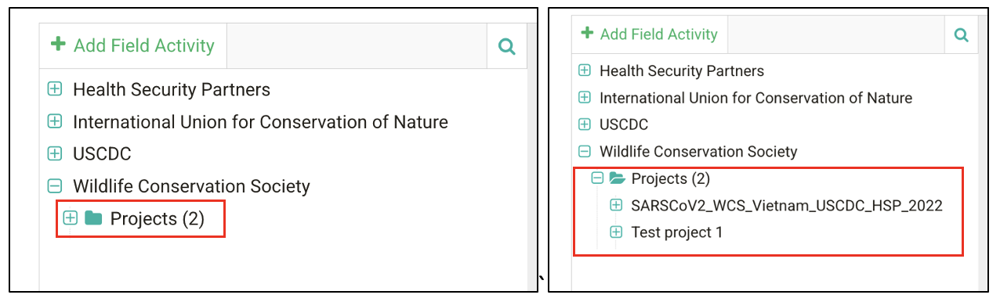{width=100%}

Similarly, to reveal folders under a specific data unit, select the “+” icon. The icon switches to a “-“ icon and contents are displayed:

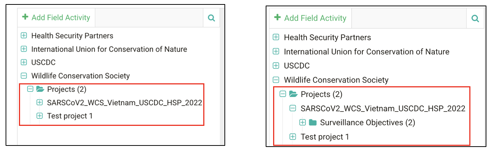{width=100%}


On selection of a data unit within any folder in the **Navigation Panel**, the “Details”, “Files”, and “Map & Tabular Data” tabs are displayed in the **Workspace Panel**.

## The Workspace Panel

The **Workspace Panel** has the buttons “Save changes” and “Cancel” on the top left. These buttons are always displayed and are inactive or active depending on the addition or modification of data units.

The button “Save changes” is grey when inactive and blue when active. The “Cancel” button is grey when inactive and dark grey when active. These buttons are inactive by default but become active when:

* A field of an existing data unit is modified, or a new file is added to an existing data unit (see “Manipulating Data to HAWK” section below). Compare the red frame in the two images below showing the switch from inactive to active buttons. The first image shows a saved data unit as currently stored with inactive buttons:

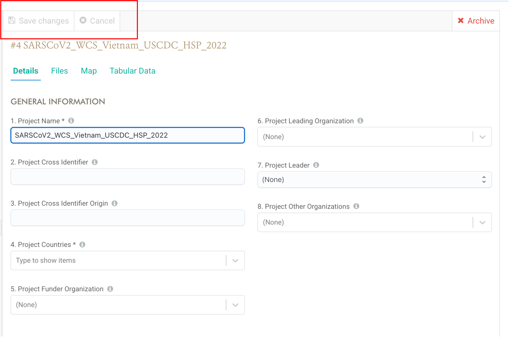{width=100%}

In the second image below, field 2 has been modified and the buttons are now active:

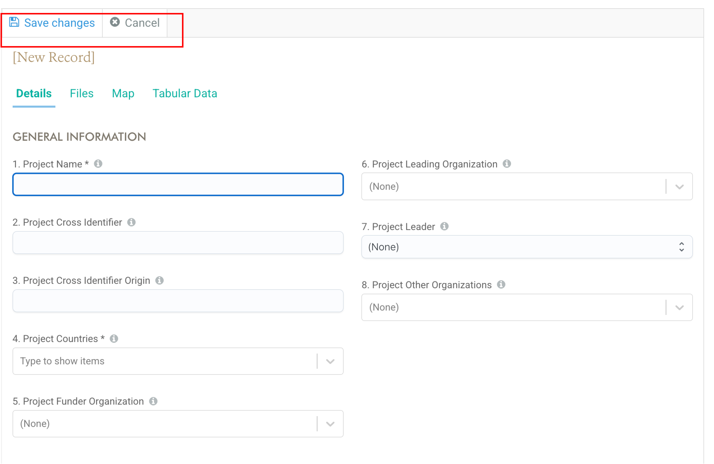{width=100%}

* A new data unit is being created but not saved yet (see “Manipulating Data to HAWK” section below). Although the “Save changes” button is active, an error message will appear if mandatory fields are not completed:

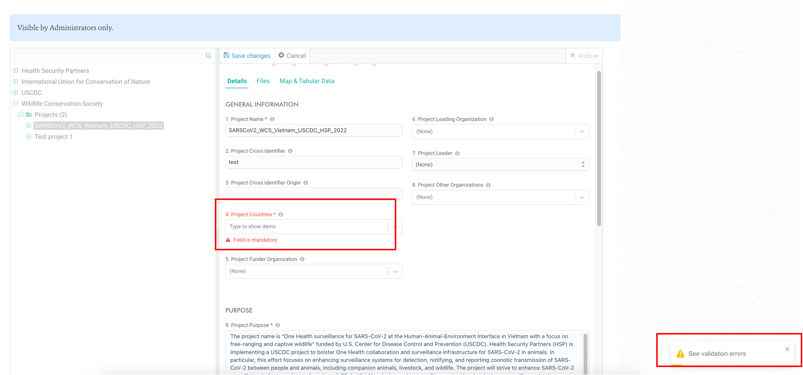{width=100%}

The **Workspace Panel** also has an “Archive” button on the top right. This button is only displayed when working on existing data units. This button is active (red) when:

* An existing data unit is opened, and it has not been modified (no edition of any field or addition or removal of files):

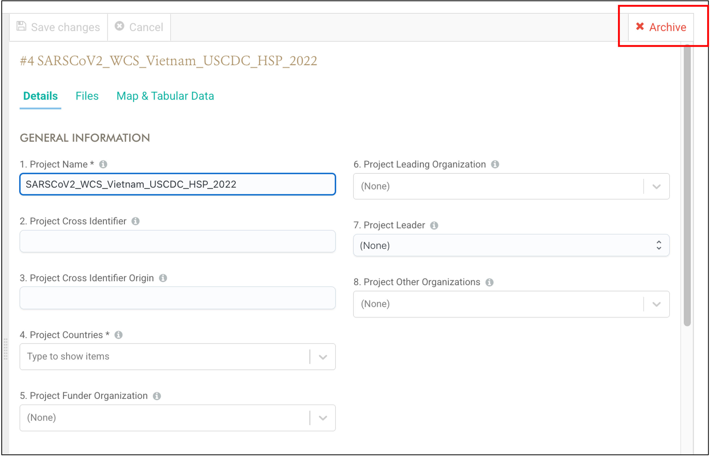{width=100%}

This button is inactive (grey) when an existing data unit has been modified but these changes have not yet been saved:

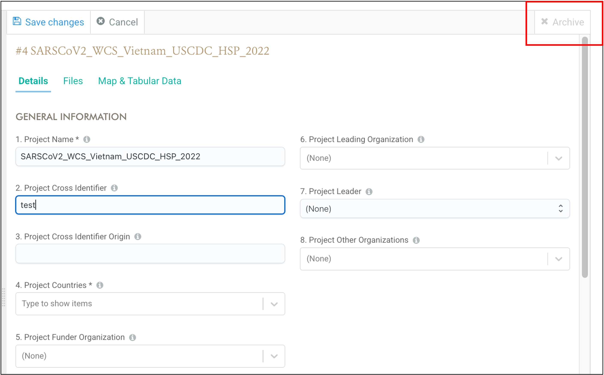{width=100%}

The “Archive” button does not appear when a new data unit is being created.

The **Workspace Panel**’s three tabs: “Details”, “Files” and “Map & Tabular Data” are described in the next sections.

## The Workspace Panel - Details Tab

The “Details” tab (red frame below) contains the variables that characterize each data unit. Existing data units contain filled fields whereas new unit fields will be blank:

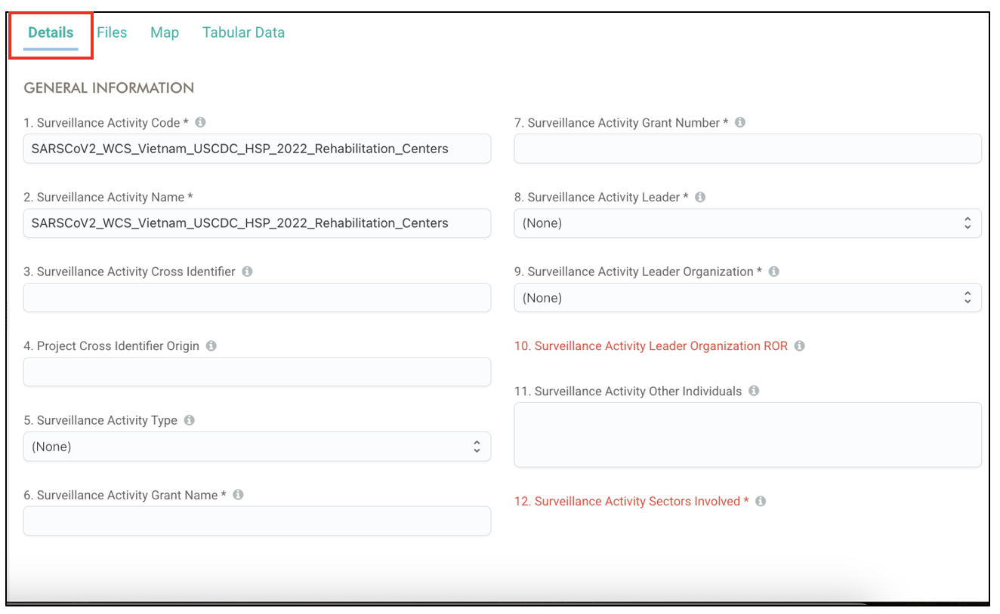{width=100%}

Users navigate across this tab by scrolling up and down. The fields are editable (active) or not. Non-active fields are grey and cannot be editable (read-only). Read only fields may occur when a user does not have edit permission or when only a single option can apply for a specific unit (i.e., environmental **Specimens** can only be collected from the field). See “Mandatory and Conditional Fields” below). Fields are logically ordered; the order is retained even as the **Workspace Panel** is modified. Compare the two images below:

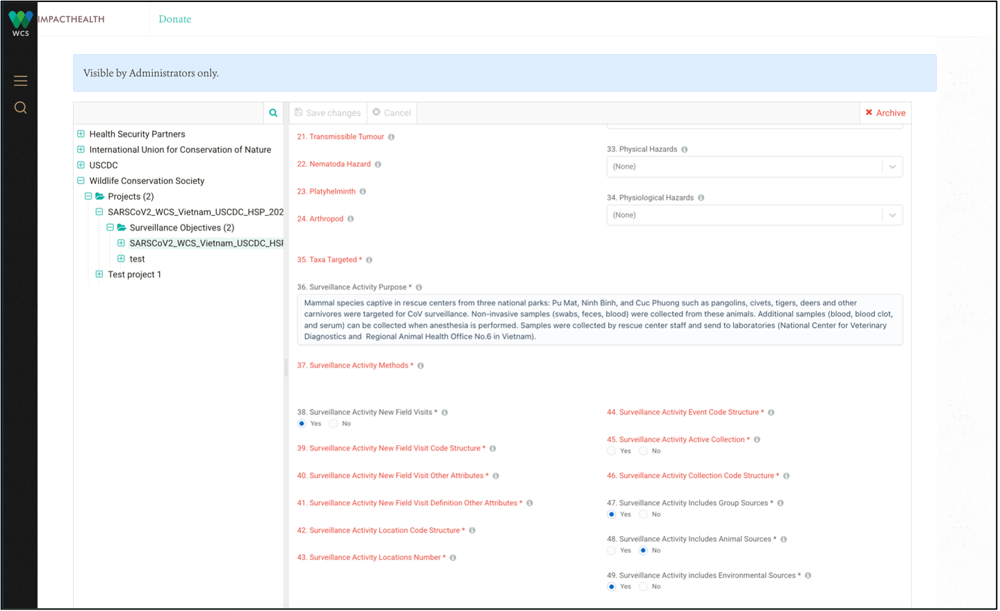{width=100%}
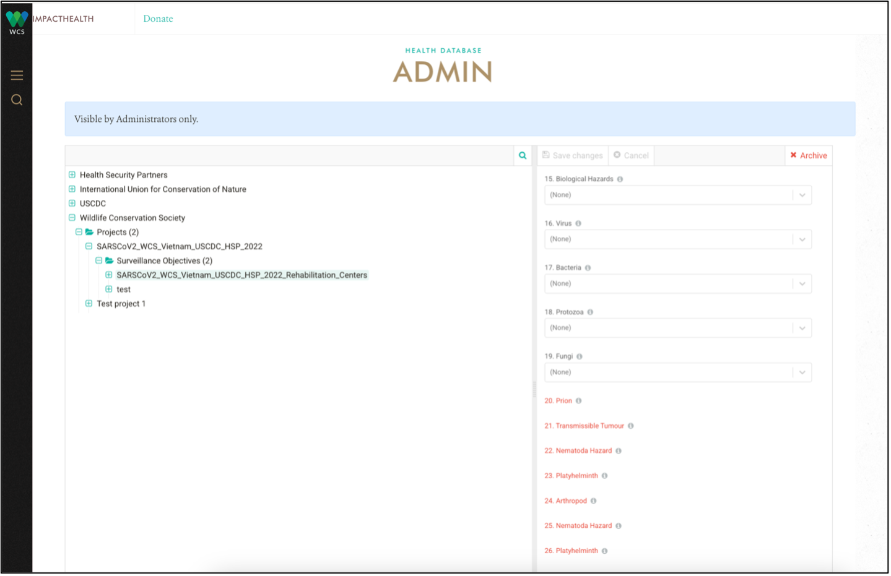{width=100%}

## The Workspace Panel - Files Tab

The “Files” tab receives and stores files associated with the selected data unit. HAWK supports many file extensions (e.g. images, pictures, videos, pdf, docx, xlsx, csv, json, shp, etc). When files have been added to a data unit, the “Files” tab lists them in the “Uploaded Files” area (blue solid frame in the image below). The “Drop the Files to Upload” area attaches files (green frame in the image below) to the selected data unit (see “Adding a New Data Unit” section below).

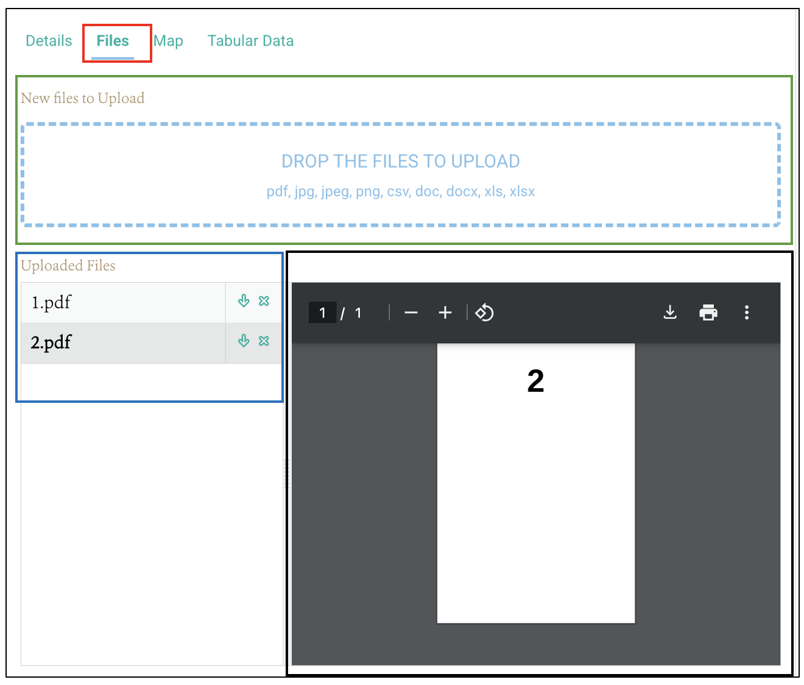{width=100%}

The “Preview” tool displays a file (black frame in the image below) selected from the list of uploaded files. When no files are associated with the data unit, the “Uploaded Files” area and the “Preview” tool are not displayed.

The relative size of the “Uploaded Files” and “Preview” tool can be modified by selecting and dragging the bar separating them to the left or right. Compare the two images below:

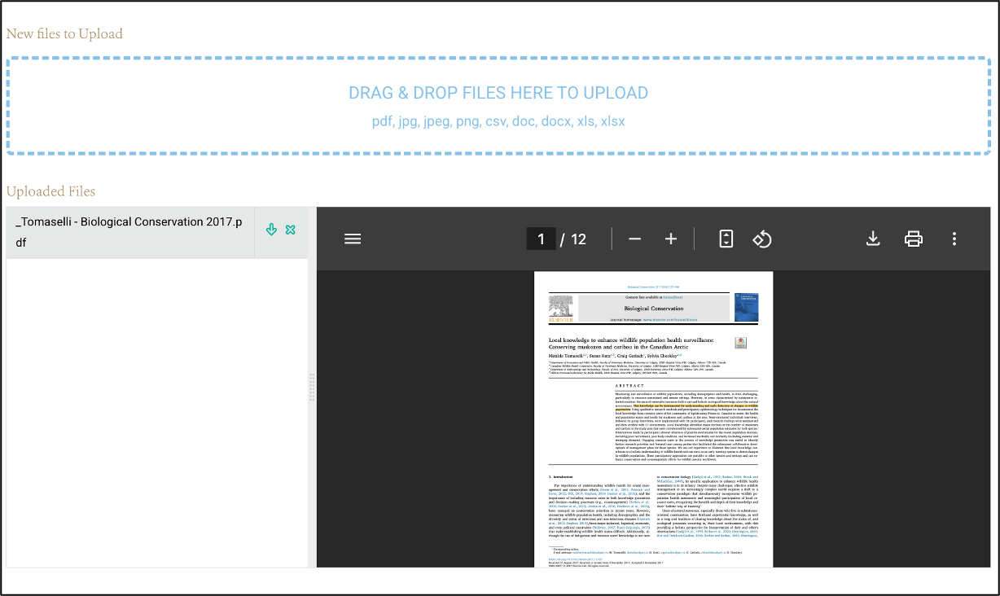{width=100%}

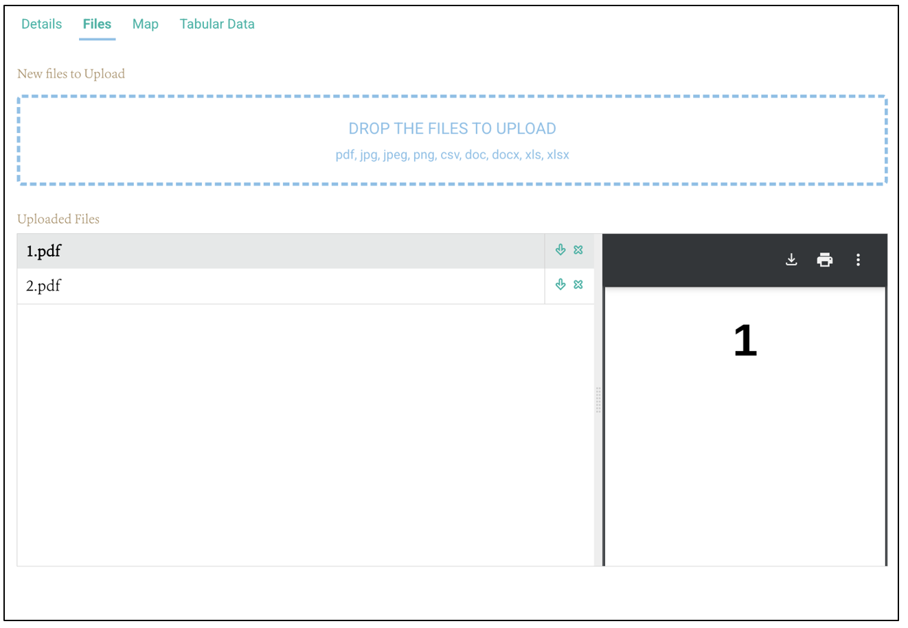{width=100%}

## The Workspace Panel - Map & Tabular Data Tab

The “Map & Tabular Data” tab displays a data unit’s spatial data (black frame in the image below) and tabular information with the relationships with the corresponding parent and children data units:

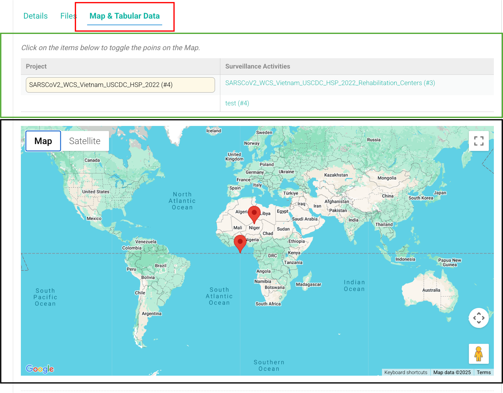{width=100%}

For a **Project**, the Map shows all **Events** across its **Surveillance Activities**, while the table shows the *Project ID* and the corresponding *Surveillance Activity IDs*. The tabular data at the **Specimens** level include the IDs of its parents. It also shows the *Specimen ID* and its children, *Diagnostics ID*.

<!-- The specific content displayed for each data unit is shown below in Table 1: -->


<!-- ```{r table, eval=TRUE, echo=FALSE, message=FALSE, warning=FALSE} -->
<!-- #| tbl-cap: Table 1. Specific fields shown in the table in the “Map & Tabular data” tab of data units, per data unit. -->

<!-- library(flextable) -->

<!-- #Project Columns:  -->

<!-- proj_col<-c("Project ID",  -->
<!--             "Project Name",  -->
<!--             "Surveillance Activity Names") -->

<!-- #Surv activity Columns:  -->
<!-- surv_act_col<-c("Project ID", -->
<!--                 "Project Name", -->
<!--                 "Surveillance Activity ID", -->
<!--                 "Surveillance Activities Name", -->
<!--                 "Field Visit Names") -->

<!-- field_visit_col<-c("Project Name", -->
<!--                    "Surveillance Activity Name", -->
<!--                    "Field Visit ID", -->
<!--                    "Field Visit Name", -->
<!--                    "Field Visit Star Date", -->
<!--                    "Field Visit End Date", -->
<!--                    "Location Cluster Names -->
<!--                    ", -->
<!--                    "Location Names") -->

<!-- location_col<-c("Project Name", -->
<!--                 "Surveillance Activity Name", -->
<!--                 "Field Visit Name", -->
<!--                 "Location Cluster Names", -->
<!--                 "Location ID", -->
<!--                 "Location Name", -->
<!--                 "Event Cluster Names", -->
<!--                 "Event IDs") -->

<!-- event_col <- c("Project Name", -->
<!--                 "Surveillance Activity Name", -->
<!--                 "Field Visit Name", -->
<!--                 "Location Cluster Names", -->
<!--                 "Location Name", -->
<!--                 "Event Cluster Names", -->
<!--                 "Event ID", -->
<!--                 "Event Date", -->
<!--                 "Collection IDs", -->
<!--                 "Source IDs") -->

<!-- collection_col <- c("Project Name", -->
<!--                     "Surveillance Activity Name", -->
<!--                     "Field Visit Name", -->
<!--                     "Location Cluster Names", -->
<!--                     "Location Name", -->
<!--                     "Event Cluster Names", -->
<!--                     "Event ID", -->
<!--                     "Event Date", -->
<!--                     "Collection ID", -->
<!--                     "Collection Method", -->
<!--                     "Source IDs") -->

<!-- source_record_col <- c("Project Name", -->
<!--                     "Surveillance Activity Name", -->
<!--                     "Field Visit Name", -->
<!--                     "Location Cluster Names", -->
<!--                     "Location Name", -->
<!--                     "Event Cluster Names", -->
<!--                     "Event ID", -->
<!--                     "Event Date", -->
<!--                     "Collection ID", -->
<!--                     "Source ID", -->
<!--                     "Source Type", -->
<!--                     "Source Record Cluster Names", -->
<!--                     "Record Number", -->
<!--                     "Initial Health Status", -->
<!--                     "Necropsy ID", -->
<!--                     "Specimen IDs", -->
<!--                     "Specimen Type") -->

<!-- specimen_col <- c("Project Name", -->
<!--                     "Surveillance Activity Name", -->
<!--                     "Field Visit Name", -->
<!--                     "Location Cluster Names", -->
<!--                     "Location Name", -->
<!--                     "Event Cluster Names", -->
<!--                     "Event ID", -->
<!--                     "Event Date", -->
<!--                     "Collection ID", -->
<!--                     "Source ID", -->
<!--                     "Source Type", -->
<!--                     "Source Record Cluster Names", -->
<!--                     "Record Number", -->
<!--                     "Specimen ID", -->
<!--                     "Specimen Type", -->
<!--                     "Diagnostic IDs", -->
<!--                     "Diagnostic Targeted Hazard", -->
<!--                     "Diagnostic Result") -->

<!-- diagnostic_col <- c("Project Name", -->
<!--                     "Surveillance Activity Name", -->
<!--                     "Field Visit Name", -->
<!--                     "Location Cluster Names", -->
<!--                     "Location Name", -->
<!--                     "Event Cluster Names", -->
<!--                     "Event ID", -->
<!--                     "Collection ID", -->
<!--                     "Source ID", -->
<!--                     "Source Type", -->
<!--                     "Source Record Cluster Names", -->
<!--                     "Record Number", -->
<!--                     "Specimen ID", -->
<!--                     "Diagnostic IDs", -->
<!--                     "Diagnostic Targeted Hazard", -->
<!--                     "Diagnostic Result",  -->
<!--                     "Diagnostic Date Sent", -->
<!--                     "Diagnostic Date Received", -->
<!--                     "Diagnostic Result") -->


<!-- # Define the data with nested lists -->
<!-- nested_data <- tibble::tibble( -->
<!--   Unit = c("Project",  -->
<!--                "Surveillance Activity",  -->
<!--                "Field Visit",  -->
<!--                "Location",  -->
<!--                "Event",  -->
<!--                "Collection",  -->
<!--                "Source Record",  -->
<!--                "Specimen",  -->
<!--                "Diagnostics"), -->
<!--   Columns = list( -->
<!--     proj_col,  -->
<!--     surv_act_col,  -->
<!--     field_visit_col,  -->
<!--     location_col,  -->
<!--     event_col,  -->
<!--     collection_col,  -->
<!--     source_record_col,  -->
<!--     specimen_col,  -->
<!--     diagnostic_col -->
<!--   ) -->
<!-- ) -->

<!-- # Print the nested data frame -->

<!-- # library(knitr) -->
<!-- # library(kableExtra) -->

<!-- unnested_data <- -->
<!--   nested_data|>  -->
<!--   tidyr::unnest(Columns)  -->

<!-- temp<- -->
<!--   flextable(unnested_data) |>  -->
<!--   merge_v(j="Unit") |>  -->
<!--   theme_box() |>  -->
<!--   width(j = "Unit", width=7, unit = "cm") |>  -->
<!--   width(j = "Columns", width=10, unit = "cm") -->


<!-- temp -->
<!-- ``` -->


The data displayed in this tab cannot be directly modified. The content of the “Map & Tabular Data” changes based on the data unit’s content in the “Details” tabs.

## System and User-Provided Identifiers

Data units in HAWK, from **Organization** to **Interpretation**, have at least one identifier. All data units receive an “ID”, a system-based identifier unique for each data unit. This field is automatically assigned by the database once a data unit is saved. “Code” fields (i.e., **Surveillance Activity** Code) are user-provided identifiers for those data units. “Name” fields are a third type of identifiers for specific data units (see online Data Dictionary) that receive a user-provided name for a data unit (i.e., “Field Activity Name”).

## Field Definitions

In addition to the data model dictionary, the definition of each field can be found in the GUI. To view the definition, select the “i” or information icon that appears to the right of each field header:


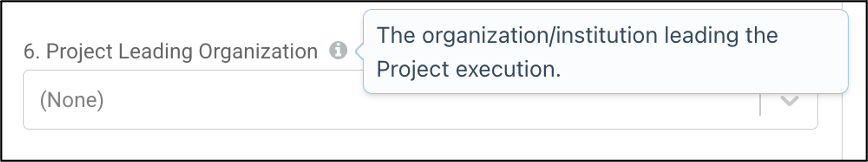{width=50%, fig-align=center}


# Data Types for Fields in HAWK

HAWK supports different data types for fields. This allows HAWK to accommodate the wide range of variables associated with wildlife health surveillance.

## Integer

These fields require an integer number and they are entered directly. For example, the number individuals observed in a Group Source in a specific demographic category:

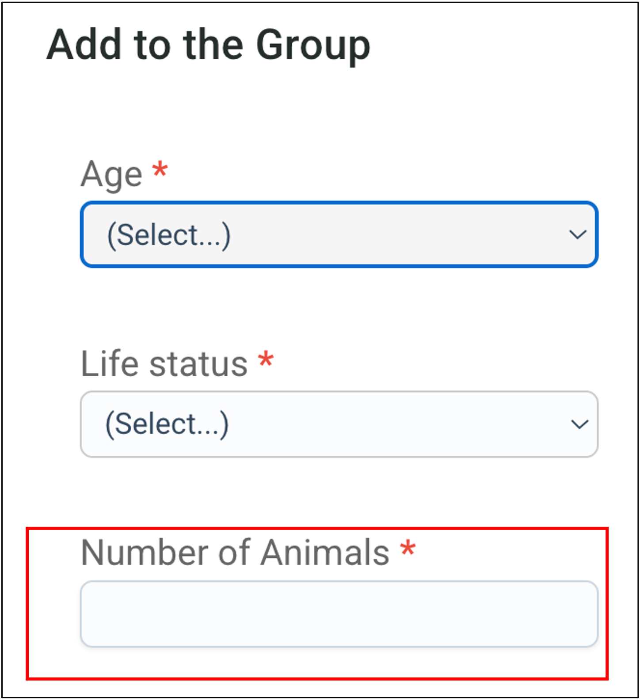{width=30%, fig-align=center}


## Floating

These fields expect a integer or non-integer number. The value must be entered directly. For example, the longitud and latitude in decimal degrees: 

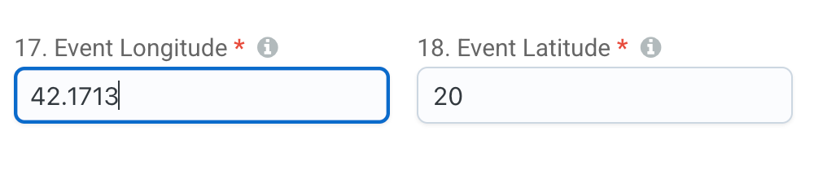{width=30%, fig-align=center}

## Date

These fields require a date. The date can be entered directly using the mm/dd/yyyy format. Alternatively, the date can be entered using the calendar icon to the right of the field. For example, the “Start Date” of a **Project**:

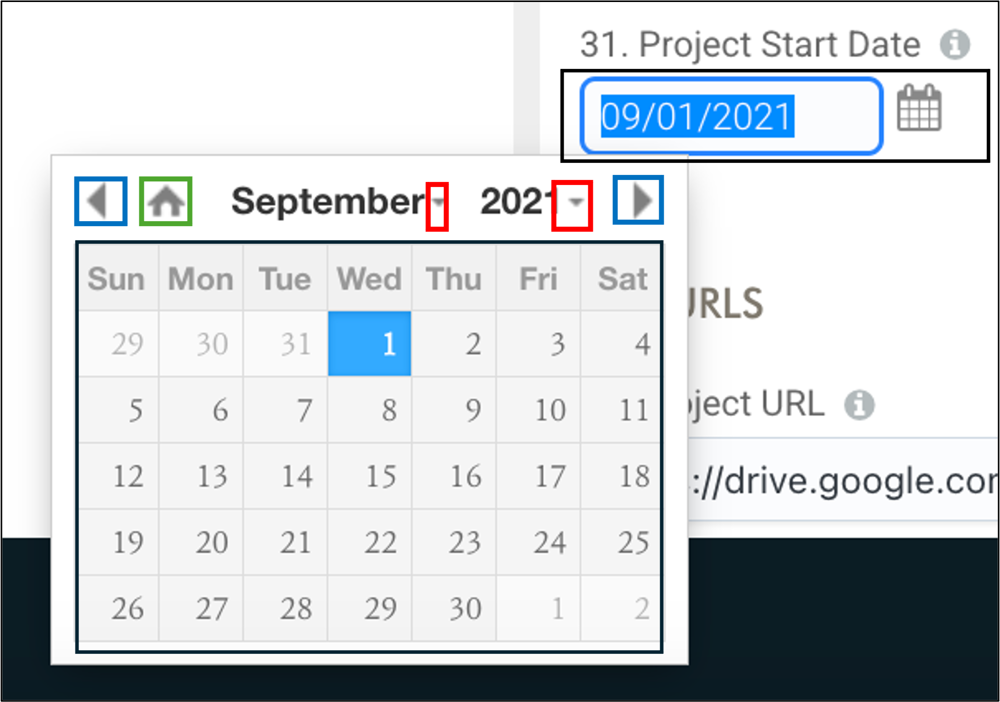{width=60%, fig-align=center}


After selecting the calendar icon, a calendar appears. The left and right arrows (blue frame in the image above) change the month sequentially backward and forward in time, respectively. The down arrows (red frame in the image above) help select a specific month and year. The home icon (green frame in the image above) resets the calendar to the current date. Enter the specific date by navigating to the correct month, year, and date and selecting it (black frame in the image above). The application will display an error message when the month value is larger than 12 and when the day value exceeds the possible number for the corresponding month (i.e., February 30th).

## Boolean

These fields request a “Yes” or “No” answer. For example, the field “Project Group Source” in **Project**

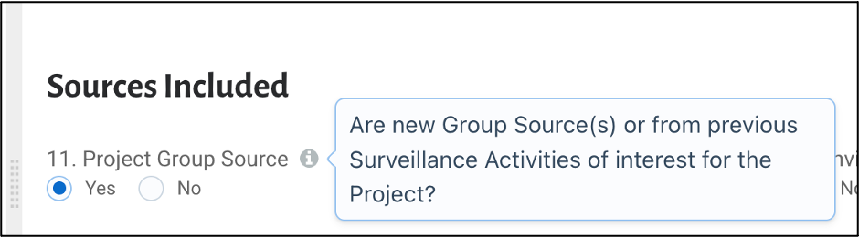{width=60%, fig-align=center}

## Single-choice List

These fields are completed by selecting one response from a list of fixed options. These fields have a down-arrow on the right that when selected open a list of options. Select a response from the list using the cursor. Alternatively, you can type a specific option, and the list will narrow to match what you've entered. For example, the “Project Leading Organization” field in **Project**:

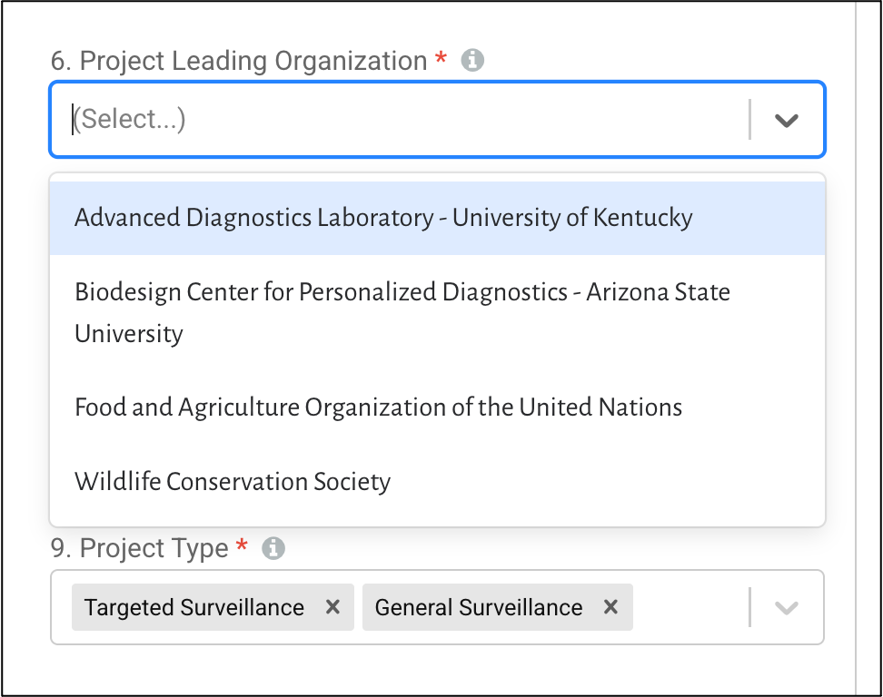{width=30%, fig-align=center}

## Multi-choice List

These fields accommodate one or more responses from a list of fixed options. These fields have a down arrow icon on the right. After selecting that icon, a list of options appears. One or more responses can be selected using the cursor. For example, the “Project Funder Organization” field of **Project** (the red frame indicates the up and down arrow):

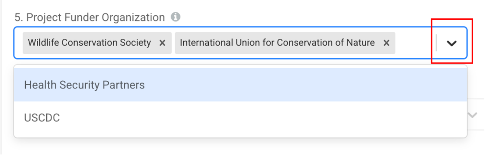{width=60%, fig-align=center}

## Text

These fields are text boxes and are used for long-form or free text written response. For example, the “Surveillance Activity Purpose” field of **Surveillance Activities**:

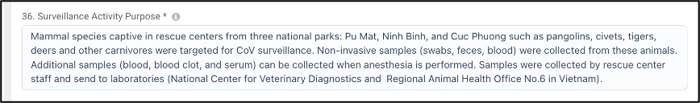{width=60%, fig-align=center}

# Active, Conditional, and Mandatory Fields in HAWK

## Active Fields

Fields in the “Details” tab that can be edited are active. Not active or read-only fields are grey in color. This may be the case if a user does not have edit permission, because only one answer applies and selection is not available, or because the system shows relevant information (e.g., fixed diagnostic test parameters). For example, the "Key URL" and "Key Citation" parameters for the diagnostic name "Minion Mk1D".

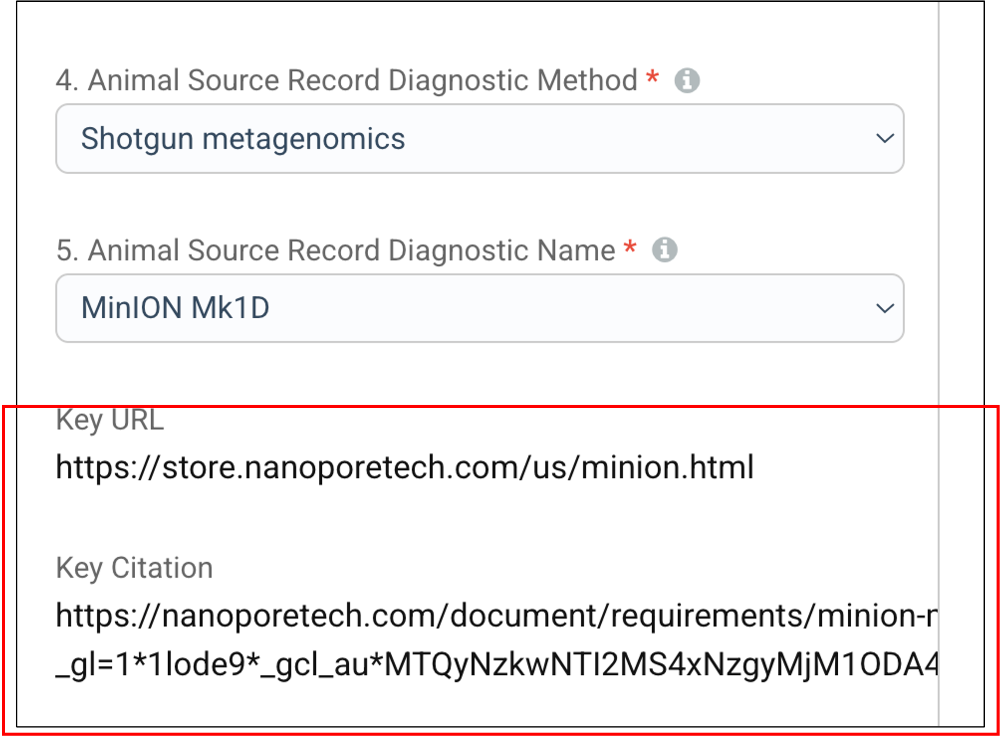{width=30%, fig-align=center}

## Conditional Fields

Some fields are not displayed until previous fields are answered or receive a specific response. These Conditional fields minimize data entry by only requesting the additional specific details when required (i.e., the field "Animal Toxins" in **Project** is available when the "Animal Toxin" option is added in field "Chemical Toxins". Compare the two images below:

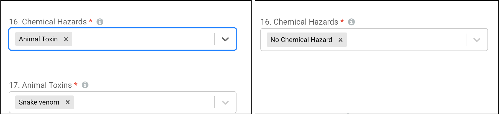{width=30%, fig-align=center}

## Mandatory Fields

Mandatory fields are indicated with an asterisk. For example the field "Project Name" in **Projecct**:

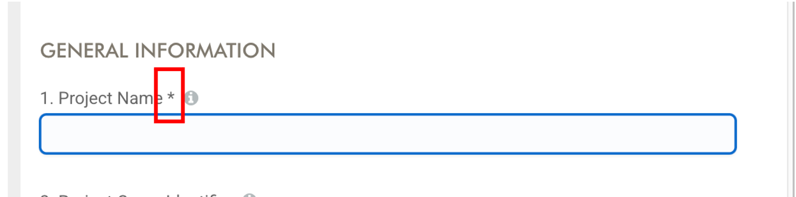{width=40%, fig-align=center}

Active Mandatory fields must be completed to save changes to the data.

# Adding Data in HAWK

## Adding a New Data Unit

The addition of data to HAWK follows the same process across all data units. To add data units:

* Navigate to the data unit folder where are a new unit is to be added

* Select its folder icon and a green “+ Add [data unit name]” button will appear in the top left corner of the **Navigation Panel** (i.e., “Add **Project**”):

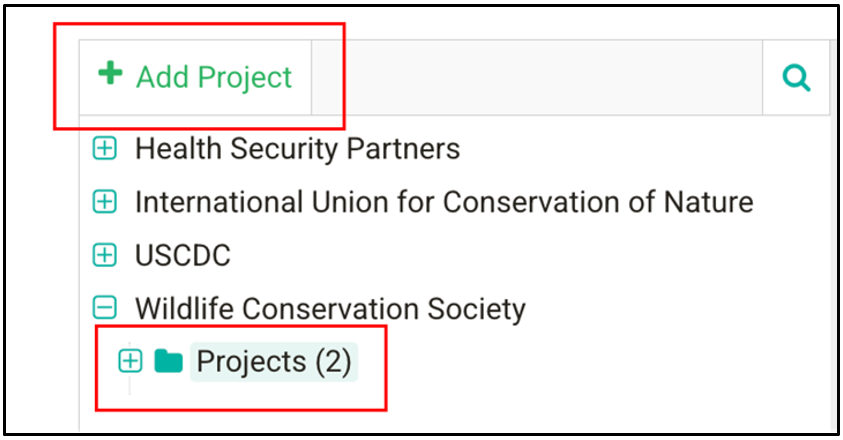{width=60%, fig-align=center}

* Select the button and a “New Record” with the three fixed tabs: “Details”, “Files”, and “Map and Tabular data” appears in the **Workspace Panel**. The “Details” tab is first by default (see red frame in the image below). As the data unit is new, all the fields in this tab are empty:

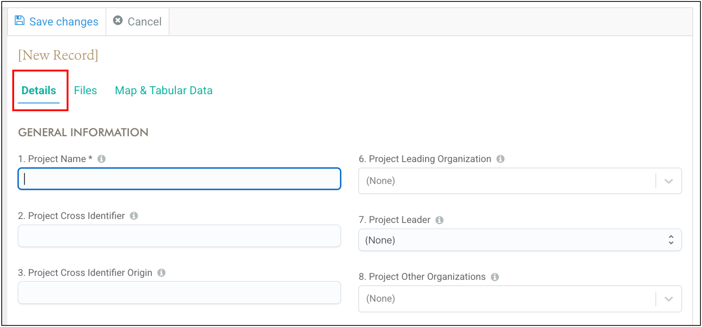{width=60%, fig-align=center}

Once the mandatory fields are completed, the new data unit can be saved by selecting “Save Changes”, located in the top left of the **Workspace Panel**:

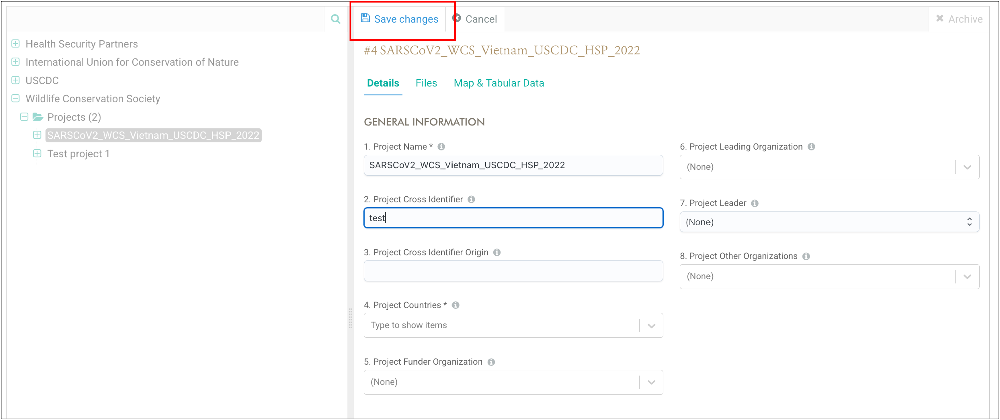{width=100%, fig-align=center}

* Adding a new data unit requires completion of the mandatory fields. Non-mandatory fields can be completed, and files can be added (see next section) after the creation of the data unit, during the creation of the data unit, or not added at all.

* Active fields that are being completed or edited are highlighted with a blue frame. Compare the fields in the images below:

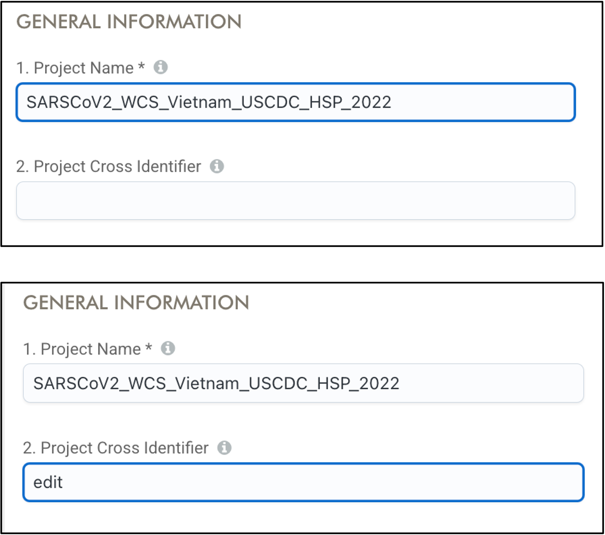{width=30%, fig-align=center}

## Adding Files to a Data Unit

To add files to a data unit:

* Navigate to the “Files” tab by selecting the “Files” button of the **Workspace Panel**. Initially, the “Files” tab will only show a “Drop the Files to Upload” box bordered with a light-blue dashed contour (red frame in the image below):

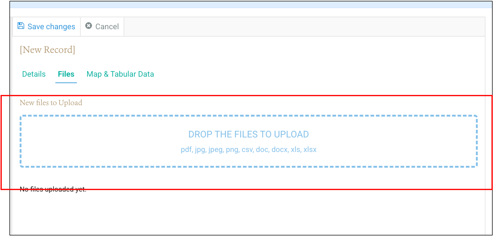{width=80%, fig-align=center}


* Upon moving the cursor to the “Drop the Files to Upload” the area will turn light blue. Select anywhere in the box, an explorer window to browse files on the computer will open:

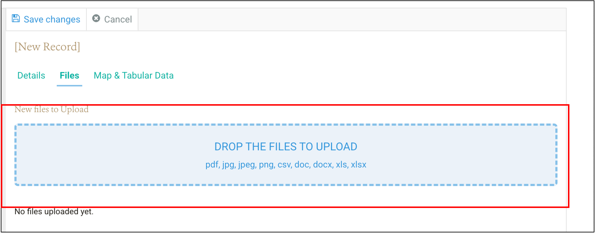{width=80%, fig-align=center}


* Select the file to upload followed by the “Open” button of the explorer window. A list will appear with the new file(s) uploaded displayed directly below the “Drop the Files to Upload” box. **These files are not yet saved in HAWK** but are rather queued for the user to confirm they are the correct files before saving:

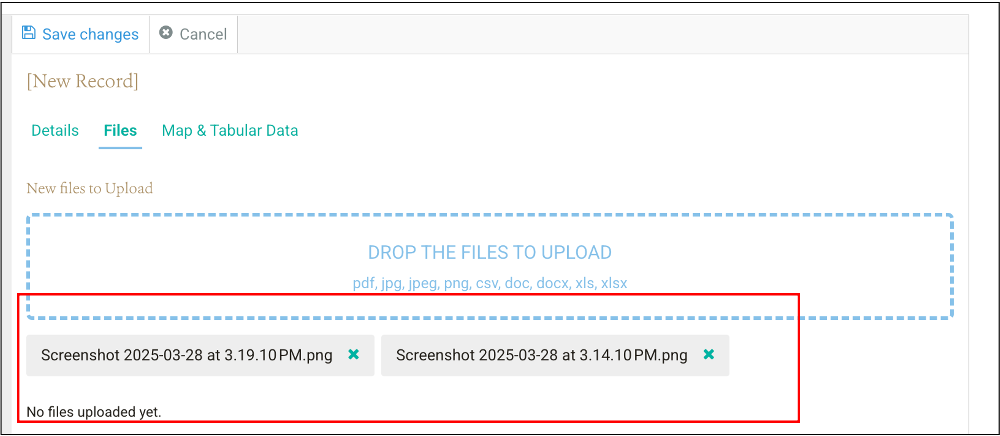{width=80%, fig-align=center}
Alternatively, drag the files to upload from your computer and drop them in the “Drop the files to Upload” area.

* **To save the files, select the “Save changes” button in the upper left corner of the Workspace Panel**. The list of the uploaded files attached to the data unit is displayed to the left of the **Workspace Panel** (the “Upload Files” area). Once one or more files are saved to a data unit the “Preview” tool will appear to the right of the **Workspace Panel**. A selected file (“Upload Files” area in the red frame on the image below) that has a compatible extension will appear in the “Preview” tool.  The selected file will have a darker grey file name than others is the list.

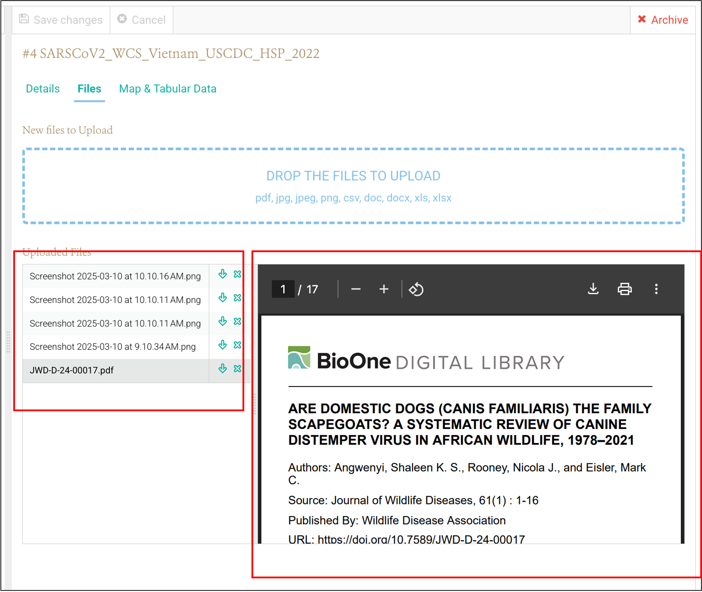{width=100%}


* The “Save changes” button is inactive (grey) when all files are saved. Add new or additional files to any data unit following the steps provided above.

## Adding a New Project to an Organization

To add a new **Project** to an **Organization**, navigate to the **Project** folder under the corresponding **Organization**, select the folder and then click “Add Project” button in the top left corner of the **Navigation Panel**. Complete the mandatory fields in the **Workspace Panel** and select the “Save Changes” button. The definition of each field is provided in the online Data Dictionary [here](https://dmontecino.github.io/WH_Database/data_dictionary.html) or by hovering over the “i” icon to the right of the field names in the “Details” tab.

### Selecting Surveillance Targets for the Project

The selection of surveillance targets at the **Project**-level depends on the fields "Project Type", "Biological Hazards", "Chemical Hazards", "Physical Hazards", and "Physiological Hazards". 

Selecting "General Surveillance" or "Outbreak Investigation" for "Project Type" does not allow to select specific targets to track and the fields "Biological", "Chemical", "Physical", and "Physiological Hazards" are automatically completed with the option "Not specific [Biological, Chemical, Physical, Physiological] target":

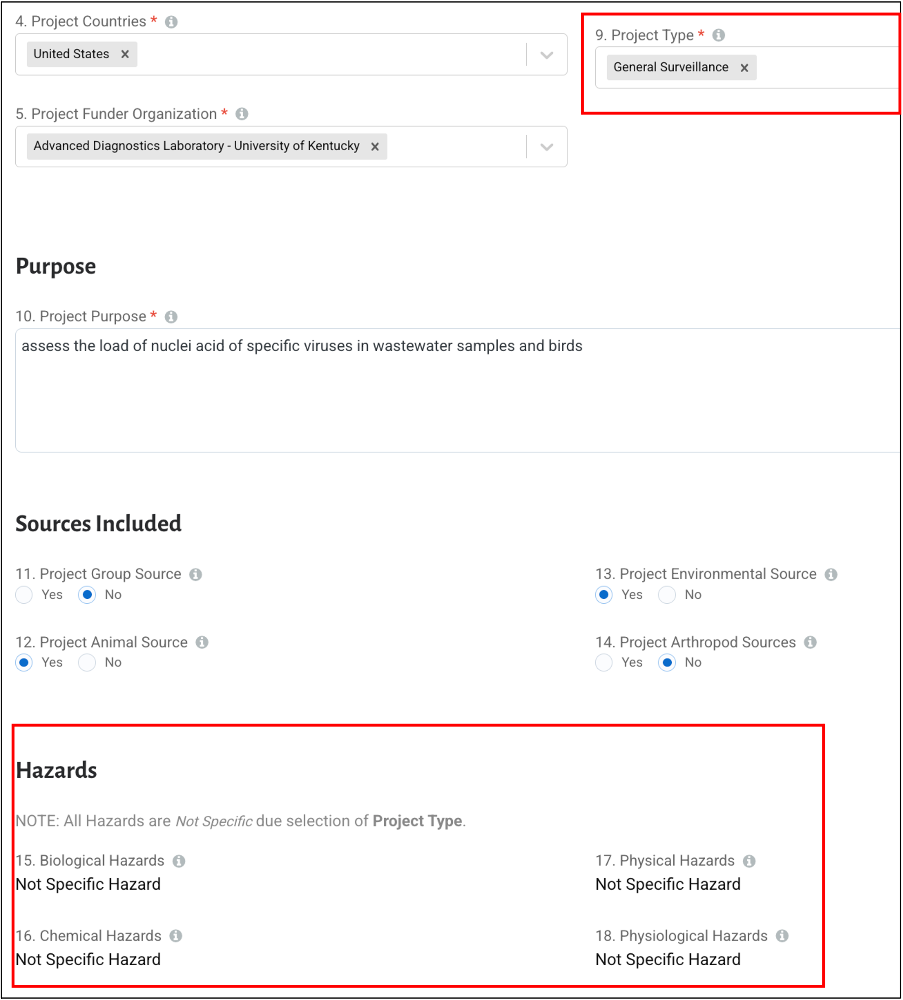{width=80%}


Selecting "Targeted Surveillance" or "Outbreak Investigation" for "Project Type" allows to select specific targets to track, therefore, the fields "Biological", "Chemical", "Physical", and "Physiological Hazards" are open to select one or multiple options. The options include "No [Biological, Chemical, Physical, Physiological] Hazard" when the **Project** does not include a specific category of hazards (see image below); "Any [Biological, Chemical, Physical, Physiological] Hazard", when there is not a specific type of target to track within the general categories (e.g., metagenomics could sequence and detect the nucleic acids of any species); and specific subcategories displayed depending on other options selected. For example, it is possible to select "Virus" for "Biological Hazards" which will display a new field "Virus". Then, a specific virus species to track can be recorded:

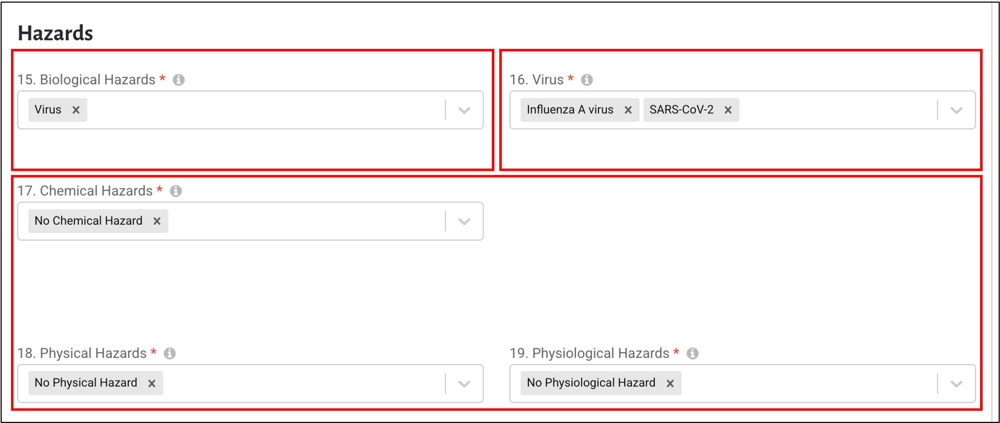{width=100%}

To track "viruses" in general, select "Virus" under "Biological Hazards" and "Any virus" under "Virus":

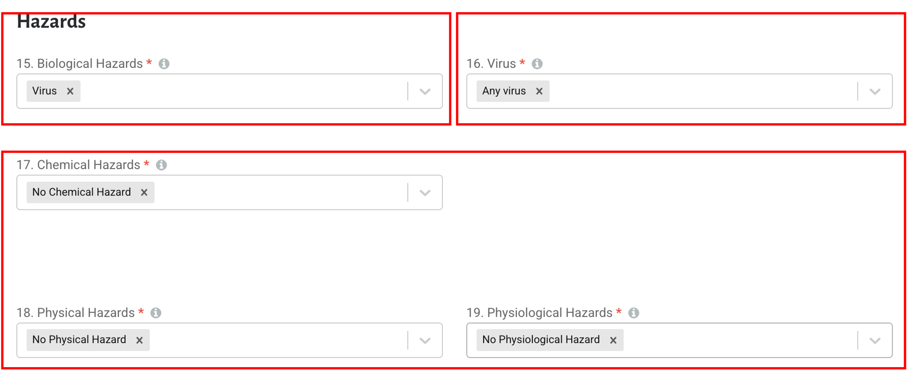{width=100%}

Multiple options can be selected for the fields "Biological", "Chemical", "Physical", and "Physiological Hazards" and the corresponding conditional fields (e.g., multiple specific viral species can be added in the "Virus" field).

The target(s) selected at the **Project** level determine the target choices available for the nested **Surveillance Activities**. So the selection of "Not [Chemical, Physical, Physiological] Hazard" for "Chemical", "Physical", "Physiological Hazard" fields at the **Project** level; selection of "Bacteria" for Biological Hazard"; and selection of "Any Bacteria" in the "Bacteria" leaves "Any Bacteria" as the only choice for the **Surveillance Activity** units (see "Selecting targets for the Surveillance Activity" below).

## Adding a New Surveillance Activity to a Project

To add a new **Surveillance Activity** to a **Project**, navigate to the **Surveillance Activity** folder under the corresponding **Project**, select the folder and then click on the “Add Surveillance Activity” button on the top left corner of the **Navigation Panel**. The addition of a **Surveillance Activity** is the most time–consuming step of data entry. These fields are also the most important because they document the methods employed to conduct the activity, including **Source**-specific metadata.

The addition of a **Surveillance Activity** is broken into two parts. A "Metadata" folder and a field data section that starts with a "Field Visit" folder. The first folder requests information about the methods to obtain field data, diagnostics used, and case definitions (*under construction*).

<!-- Therefore, the addition of a **Surveillance Activity** is broken into three parts. The first part captures information about who, when, where, what, why, and how of the **Surveillance Activity** (*under construction*): -->

<!-- The second part documents the specific methods and information for each **Source** type. A **Surveillance Activity** can include between one to four different types of **Sources** (*Group*, *Animal*, *Environmental*, and *Arthropod* **Sources**). Each *Source* type included in the **Surveillance Activity** requires completion of a specific set of fields (*under construction*): -->

<!-- The third part is only necessary when **Source Records**, **Events**, or **Locations** are nested or grouped in either spatial or temporal clusters in the **Surveillance Activity**. When used these fields help document the structure of the **Clusters**. -->

<!-- **In the case of Source Records**: (*under construction*) -->

<!-- **In the case of Events**: (*under construction*) -->

<!-- **In the case of Locations**: (*under construction*) -->

<!-- The data dictionary and the “i” or information icon provide additional guidance on completing the fields in part three. -->

The answers provided in the Surveillance Activity determined the fields or options available within the Surveillance Activity and the folders, fields, or options of its nested units (**Field Visits**, **Locations**, etc). For example, if the answer to "..." is "No", then it is not possible to add "Environmental Sources" to the **Surveillance Activity**. Similarly, it is only possible to track those targets reported in **Surveillance Activity** (see below).

### Selecting targets for the Surveillance Activity

The surveillance targets at the **Surveillance Activity**-level depends on the target(s) selected in the parent **Project** and the choice for the "Surveillance Activity Type" field in the **Surveillance Activity** unit. The options for "Surveillance Activity Type" depend on the choice(s) selected for "Project Type" field in the parent **Project** unit. If "Project Type" only includes "Targeted Surveillance", then the only option available for "Surveillance Activity Type" is "Targeted Surveillance".

Selecting "General Surveillance" or "Outbreak Investigation" for "Surveillance Activity Type" does not allow to select specific targets tracked and the field "Surveillance Activity Hazard Names" shows the options "Any Biological Hazard", "Any Chemical Hazard", "Any Physical Hazard", and "Any Physiological Hazard". The selection(s) should reflect the broad categories of targets to be tracked.


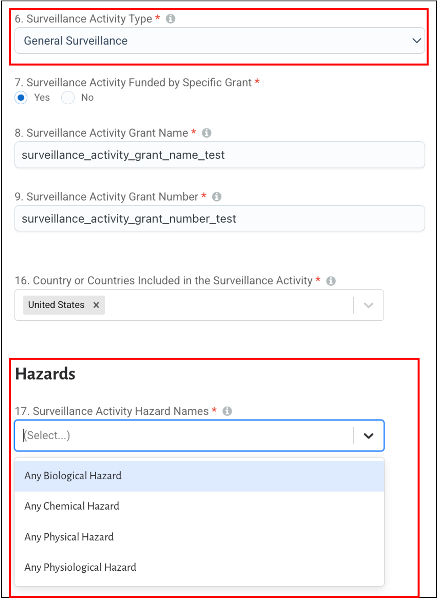{width=80%}

Selecting "Targeted Surveillance" or "Outbreak Investigation" for "Surveillance Activity Type" allows to select specific target(s) to track. The field "Surveillance Activity Hazard Names" will contain a list based on the selections at the **Project** level. For example, the option "Any virus" should be selected if any virus is targeted during a **Surveillance Activity**: 

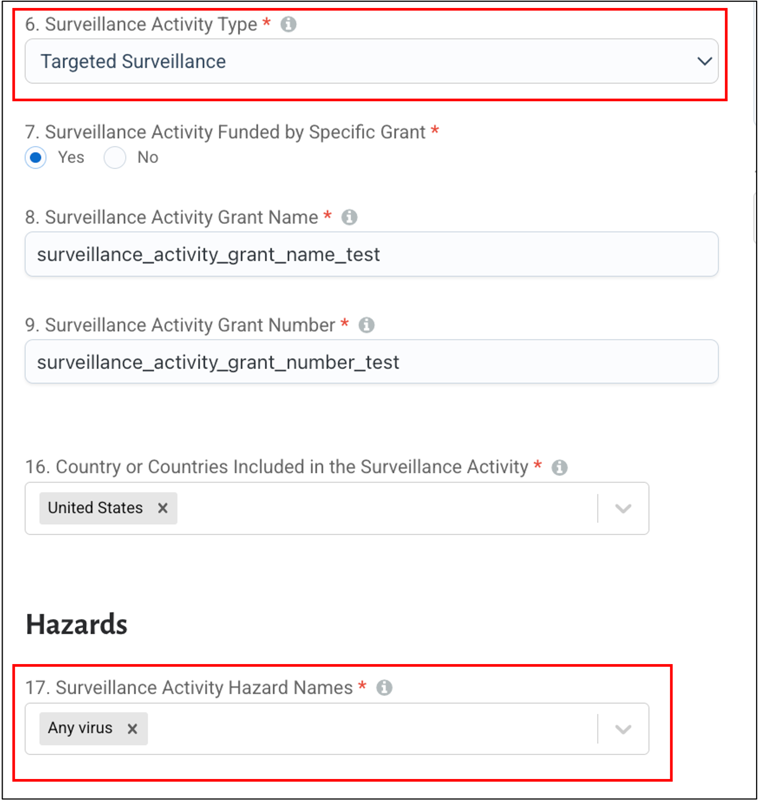{width=80%}

Multiple options can be selected for the field "Surveillance Activity Hazard Names".

The target(s) selected at the **Surveillance Activity** level determine the target choices available for the nested **Interpretation** units.

## Adding a New Field Visit to a Surveillance Activity

To add a new **Field Visit** to a **Surveillance Activity**, follow the instructions in “Adding a New Data Unit”.

## Adding a New Location to a Field Visit

To add a new **Location** to a **Field Visit**, follow the instructions in “Adding a New Data Unit”.

## Adding an New Collection to a Location

**Collections** are added to **Locations** when there is an “effort” to collect **Events**. A **Collection** includes a spatial effort (i.e., track like a transect, areal like the exploration of a beach looking for dead birds, or point like a camera trap or a mist net), and a temporal effort (i.e., the time conducting the spatial effort). 

<!-- A temporal effort **can either begin or end** at the time an **Event** starts (i.e., hours since the **Event** starting time). The spatial effort can either begin or end at the spatial coordinates of the **Event** (i.e., distance walked to the latitude/longitude of the **Event**). **Collections** occur at an **Event**, but an **Event** can contain several **Collections** (i.e., two mosquito traps, a mist net, and an air filter at the “same” **Event**). -->

<!-- When an **Event** contains **Collections**, a series of fields to document the effort to obtain **Source Records** are available, including the effort unit (i.e., meters, hours, etc.), the effort quantity (a number), and the spatial and temporal position of the effort with respect to the **Event** spatio-temporal coordinates (i.e., since the **Event** started): -->

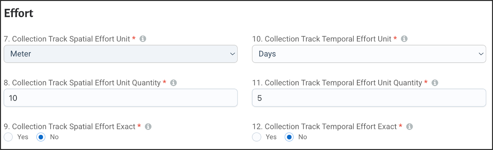{width=100%, fig-align=center}
Opportunistic findings do not have an effort and the associated **Events** should be added to the folder "Collection No Effort". The **Collection** types available to add are those reported in the **Surveillance Activity**. Areal, track, and point **Collections** have a start and an end date.

For more details, refer to the Data Model Manual [here](https://dmontecino.github.io/WH_Database/data_model.html).

## Adding an New Event to a Collection

The **Event** data contains the spatial and temporal coordinates. Coordinates can be entered in decimal degrees; degrees, minutes, and seconds; or Universal Transverse Mercator. The coordinate system selected will determine what spatial coordinate information is required. For degrees, minutes, and seconds:


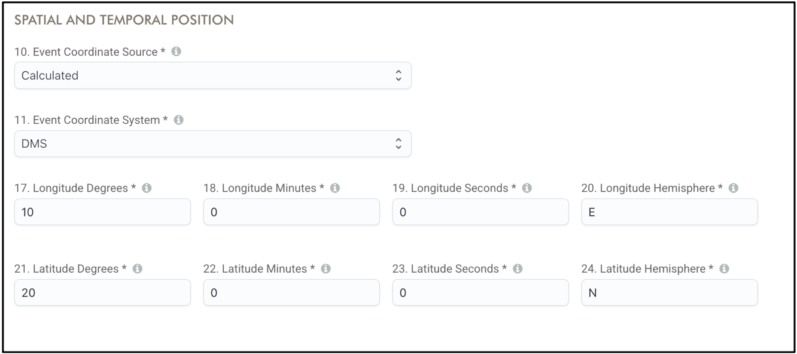{width=80%, fig-align=center}

For decimal degrees:

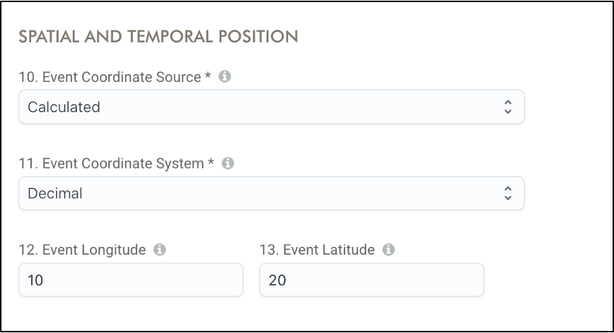{width=50%, fig-align=center}

For Universal Transverse Mercator:

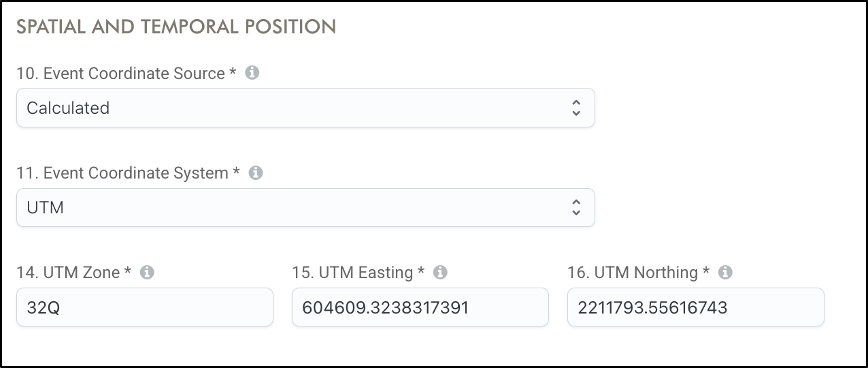{width=60%, fig-align=center}


The database documents the original coordinate system and automatically converts to other coordinate systems.

<!-- The red pin on the map in the “Map & Tabular Data” tab can be moved to a new **Location** using the cursor and the left button of the mouse (select the pin, then drag and drop the pin at the new desired **Location**). Moving the pin modifies the associated fields, including the latitude, longitude, country, etc (*under construction*). -->

The field “Event Coordinate Source” documents the accuracy of the spatial coordinates. For example, if the coordinates were obtained with a GPS device, calculated based on the distance to a site with known coordinates, or estimated by pointing a site in a digital map and recovering the coordinates returned by the digital map (i.e., Google Earth):

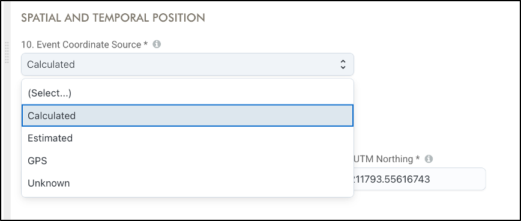{width=60%, fig-align=center}


## Adding Source Records to an Event

To add a **Source Record** to an **Event**, it is necessary to choose the right folder type under the **Event**. The set of fields to complete for each **Source Record** is different. For **Group Source Records**, the number of individuals per species, life status, sex, and age is completed using a pop-up window that adds rows to a table informing the total number of individuals in the **Source Record**: 

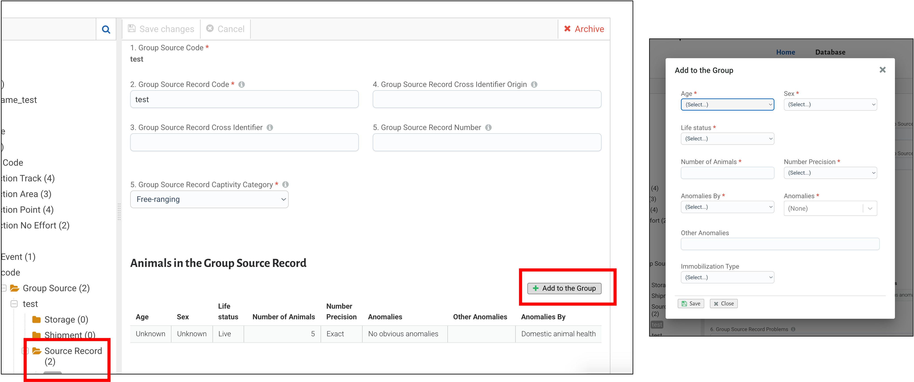{width=100%, fig-align=center}


For **Animal Source Records**, fields request information to complete specific information regarding vaccinations, data of a dead animal, and what is the fate of the carcass in those cases: 

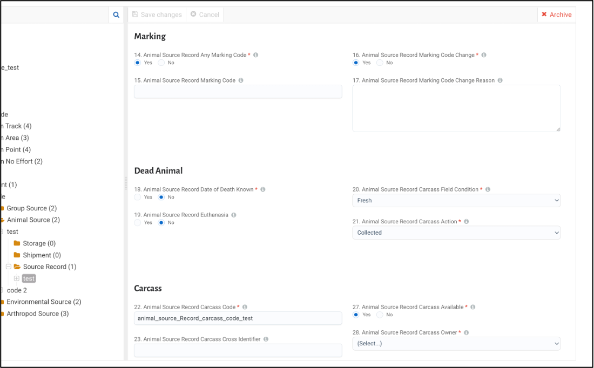{width=80%, fig-align=center}


For **Environmental Source Records** fields are meant to request data on the current visit to the **Environmental Source**.

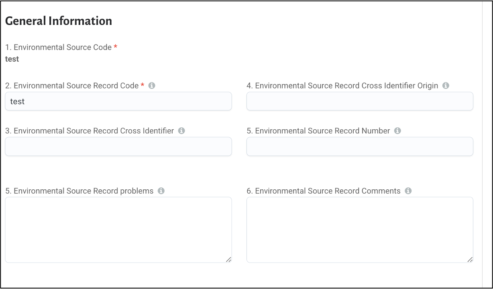{width=80%, fig-align=center}

For **Arthropod Source Records** the fields include the number of individuals per species, life status, sex, and condition. This information is completed using a pop-up window that adds rows to a table informing the total number of individuals. Click the "Add to the Arthropod Source Record" button:

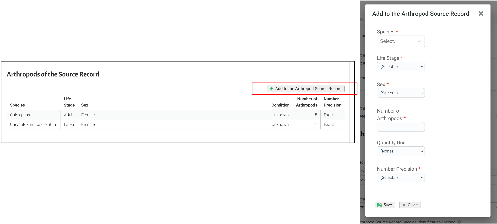{width=100%, fig-align=center}


When the **Collection** containing an **Arthropod Source Record** does not require effort (not Track, Area, or Point Collection), the information regarding the retrieval of arthropods in the **Arthropod Source Record** is requested. For **Arthropod Source Record** under Track, Area, or Point Collection, that information can be inferred from the spatial effort reported (e.g., C02 trap).

## Adding a Necropsy to an Animal Source Record

A **Necropsy** can be added only to **Animal Source Records**. Just like with other units, to add a **Necropsy** the user needs to identify the "Necropsy" folder under the **Animal Source Record** receiving the necropsy data. Fields in the **Necropsy** unit include open text boxes per body system, condition of the carcass at necropsy, where the necropsy was conducted, and if the necropsy is full or partial, among others.

More than one **Necropsy** can be added to each **Animal Source Record** in case a partial necropsy, a general necropsy, or a secondary necropsy are conducted on the same individual.

## Adding Specimens to a Source Record

**Specimens** are used for **Diagnostics**. **Specimens** originate from sampling a **Group Source Record**, an **Animal Source Record**, and an **Environmental Source Record**, and from the arthropods in an **Arthropod Source Record**. 
<!-- (i.e., an oral swab from an individual animal; the **Specimen** within the green boxes in figure below) -->

<!-- * **Specimens** can also originate from a **Diagnostic**. The product of a **Diagnostic** can be used in further **Diagnostics** (i.e., metagenomics on amplified nucleic acids) (*under construction*). -->

<!-- * **Specimens** can also originate by pooling previous **Specimens** already recorded in the database (*Pooled Specimens*) (*under construction*): -->

<!-- 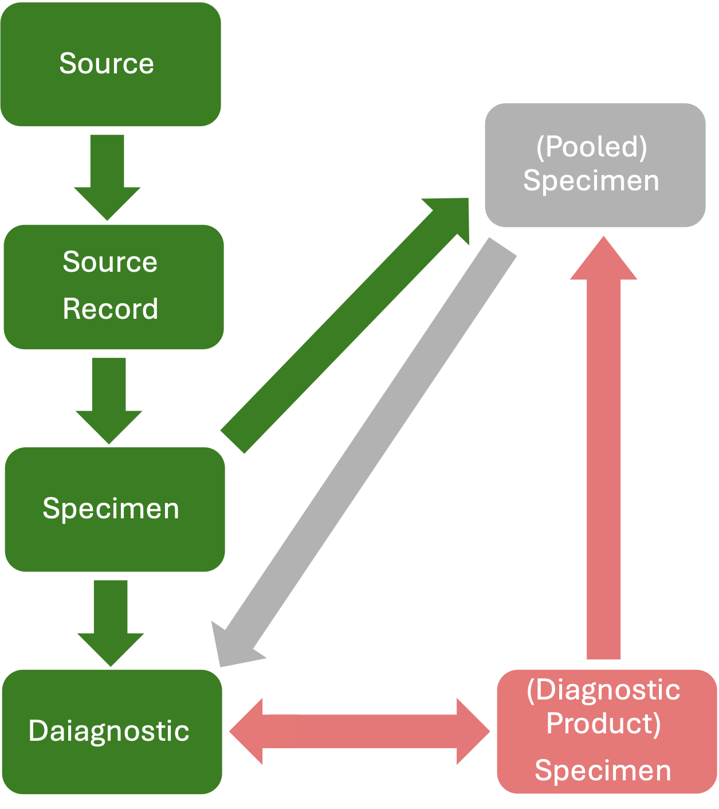{width=60%, fig-align=center} -->


<!-- Notably, a **Specimen** that includes different types of tissue from the same **Source Record** is not a Pooled Specimen, but a **Specimen** of “mixed tissue” type. -->

<!-- Each **Specimen** belongs to one or more **Source Record**(s) depending on its origin.  -->

In HAWK, **Specimens** originating directly from a **Source Record** are added in the folder “Specimens". 

<!-- **Specimens** originating from a **Diagnostic** Product are in the folder called “Specimen from **Diagnostic** Products” (*under construction*): -->

<!-- Pooled Specimens belong to each **Source Record** involved in their generation.  Consequently, in  HAWK, a Pooled Specimen can be found in the “Pooled Specimens” folder under either the “Specimens from Source Records” folder and/or “Specimen from Diagnostic Products” folder of each **Source Records** involved in the generation of the Pooled Specimen (*under construction*): -->

**Specimens'** characteristics include the tissue type, the quantity, the medium, and field storage.

**Specimens** belonging to an **Environmental Source Record** linked to a **Collection** without effort (not Track, Area, or Point Collection), require information regarding their retrieval (**Environmental Source Record** is a site at time *t* and, therefore, it is not retrievable). For **Environmental Source Record** under Track, Area, or Point Collection, that information for the corresponding **Specimens** can be inferred from the spatial effort reported (e.g., device to obtain particles from the air at the **Environmental Source**).

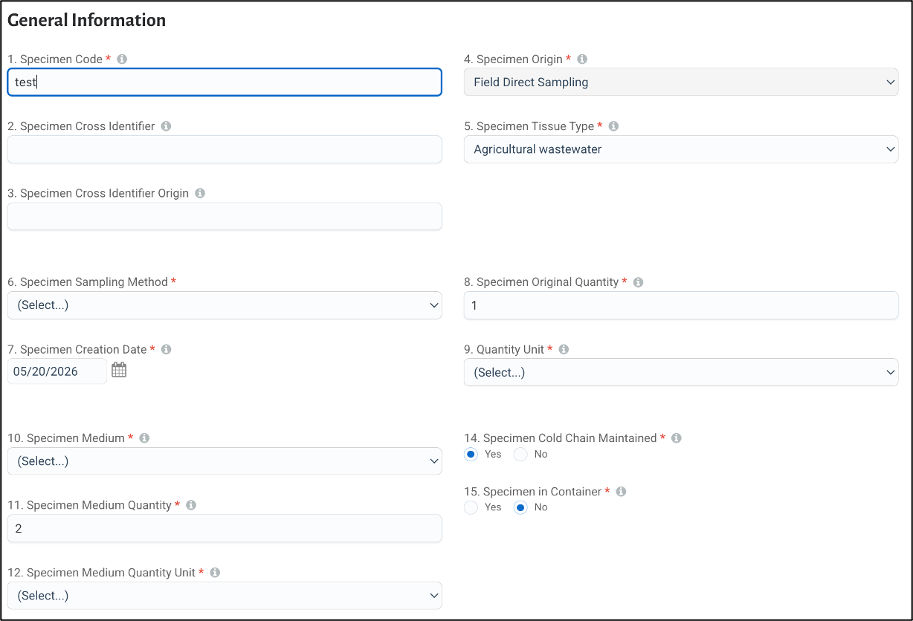{width=100%, fig-align=center}


<!-- ### Adding Specimens to a Source Record  -->
<!-- <!-- – From Source Records --> -->

<!-- **Specimens** are added to a **Source Record** data unit, specifically to the “**Specimens** from **Source Records**” folder if they were taken directly from the Source (i.e., “oral swab”). Navigate to the “**Specimens** from **Source Records**” folder under the corresponding **Specimen**, select the folder and then click “Add **Specimen**” in the top left corner of the **Navigation Panel**. Complete the mandatory fields in the **Workspace Panel** and select the “Save Changes” button. -->

<!-- ### Adding Specimens to a Source Record – From Diagnostic Products (*under construction*) -->

<!-- **Specimens** are added to a **Source Record** data unit, specifically to the “Specimens from Diagnostic Products” folder if they are a product of a **Diagnostic** conducted with a **Specimen** directly collected from a **Source Record** (i.e., cDNA generated after the genetic material in an “oral swab” is amplified after a RT-PCR **Diagnostic**). Navigate to the “Specimens from Diagnostic Products” folder under the corresponding **Specimen**, select the folder and then click “Add Specimen” in the top left corner of the **Navigation Panel**. Complete the mandatory fields in the **Workspace Panel** and select the “Save Changes” button (*under construction*). -->

<!-- ### Adding Pooled Specimens to a Source Record – Pooled Specimens (*under construction*) -->

<!-- In the database, Pooled Specimen parents are the **Specimens** included in the Pooled Specimens. Therefore, a Pooled Specimen data unit must be added to the corresponding “Pool Specimen” folder of each **Specimens** from **Source Records** or from **Diagnostic Products** that provide content for the new pooled specimen. In the figure above, the Pooled Specimen (grey box) should be added to the “Specimens from Source Records” folder of the “Source Record” in the green box, and also to the “Specimens from Diagnostic Product” folder of this **Source Record** (the **Diagnostic Product Specimen** in the pink box also creates the Pooled Specimen). -->

<!-- To add a Pooled Specimen, select the correct folder and then click “Add Pooled Specimen” in the top left corner of the **Navigation Panel**. Complete the mandatory fields in the **Workspace Panel** and select the “Save Changes” button (*under construction*). -->

## Adding Diagnostics to a Specimen

To add a **Diagnostic** to a **Specimen**, navigate and select the “Diagnostic” folder under the “Specimen” folder and then click “Add Diagnostic” in the top left corner of the **Navigation Panel**. Complete the mandatory fields in the **Workspace Panel** and select the “Save Changes” button. **Diagnostic** information includes the type of diagnostic and based on this selection there is a subset of specific diagnostic names. Moreover, certain diagnostic names will reveal diagnostic-specific parameters (e.g., metrics of the sequencing process completed through metagenomics techniques). Diagnostics names also reveal read-only information. For example, key citations for the diagnostic name.

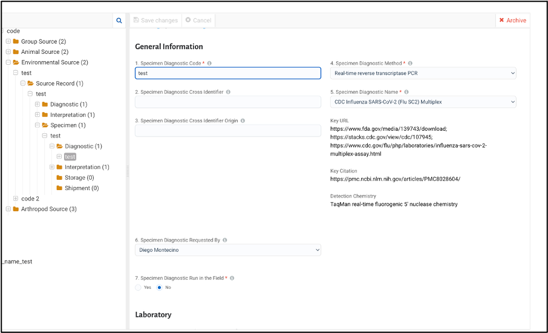{width=100%, fig-align=center}


## Adding Diagnostics to a Group, Animal, or Environmental Source Record

A **Diagnostic** can be added directly to a **Group Source Record**, to an **Animal Source Record**, and to an **Environmental Source Record**. A group of frogs can be tested together, an individual can undergo an MRI or a clinical examination, and turbidity can be measure in the water at an **Envronmental Source Record**. To add a **Diagnostic** navigate to the “Diagnostics” folder linked to the **Source Record** directly, select the folder and then click “Add Diagnostic” in the top left corner of the **Navigation Panel**. Complete the mandatory fields in the **Workspace Panel** and select the “Save Changes” button. 

Just like with the **Diagnostics** for Specimens, **Diagnostic** information includes the type of diagnostic and based on this selection there is a subset of specific diagnostic names. Moreover, certain diagnostic names will reveal diagnostic-specific parameters (e.g., mode used in ultrasound diagnostic). Diagnostics names also reveal read-only information. For example, key citations for the diagnostic name.

## Adding a Result to a Diagnostic

To add a **Result** to a **Diagnostic** navigate to the “Results” folder linked to the **Diagnostic**, select the folder and then click “Add Result” in the top left corner of the **Navigation Panel**. Complete the mandatory fields in the **Workspace Panel** and select the “Save Changes” button. 

Each **Result** reports an outcome of the parent **Diagnostic** test for one specific target. The hazard choices available are specific based on the selection of "Diagnostic Name" in the parent **Diagnostic**. A **Result** can request specific information associated with the target detection. For example, the gene holding the nucleic acids amplified by a specific PCR assay. The **Result** request the unit of the diagnostic outcome (e.g., ct curve) and the value of the outcome.

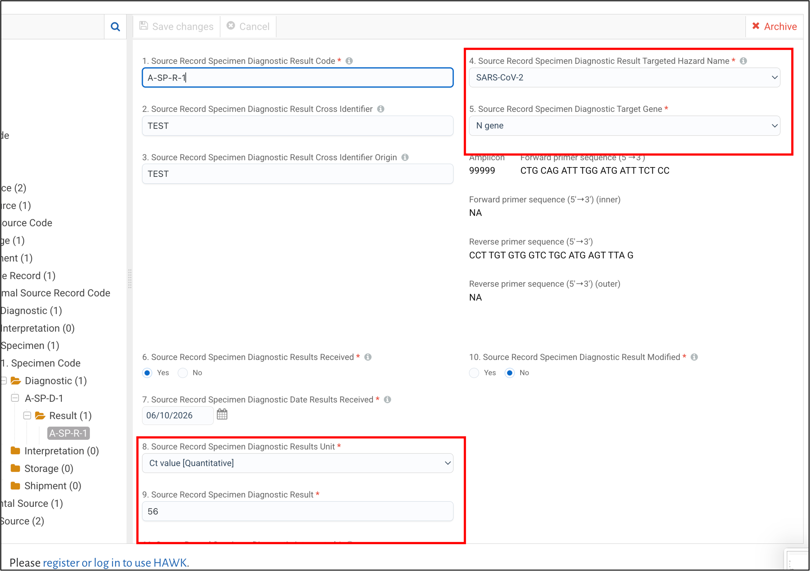{width=100%, fig-align=center}

Uploading a file to support the output of a **Result** is best practice and strongly encouraged. For example, an electrophoresis gel image of amplified genetic products, including negative and positive controls, alongside a ladder showing bands in the expected wells and sizes:

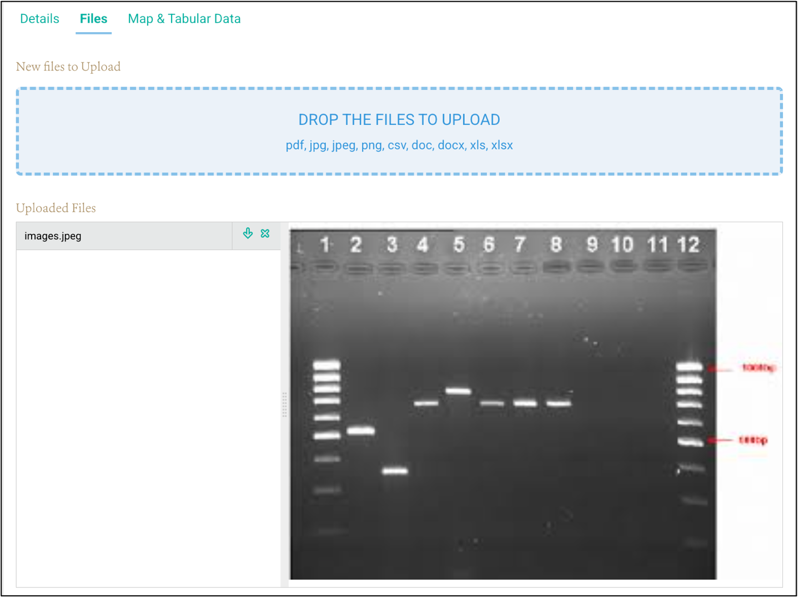{width=100%, fig-align=center}

A **Result** can be interpreted as "Positive", "Negative", or "Undetermined" depending on the case definition for a specific target. To provide the interpretation of the **Result**, the question "[Source Record Specimen,  Source Record] Diagnostic Interpreted" must be answered "Yes". Then, a set of fields to provide an interpretation to the result will be displayed: 


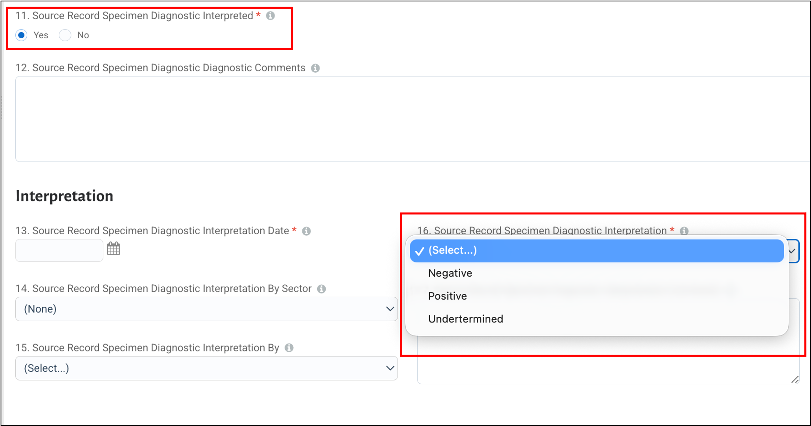{width=100%, fig-align=center}


## Adding an Interpretation to a Specimen

To add an **Interpretation** to a **Specimen** navigate to the “Interpretation” folder linked to the **Specimen**, select the folder and then click “Add Interpretation” in the top left corner of the **Navigation Panel**. Complete the mandatory fields in the **Workspace Panel** and select the “Save Changes” button. 

The **Interpretation** categorizes a **Specimen** as "Positive", "Negative", or "Undetermined" for a specific surveillance target based on the case definition. For example, a **Specimen** could have mixed **Results** for the same target (e.g., some positive and some negative). The final categorization for that **Specimen** is needed.

## Adding an Interpretation to a Source Record

To add an **Interpretation** to a **Source Record** navigate to the “Interpretation” folder linked to the **Source Record**, select the folder and then click “Add Interpretation” in the top left corner of the **Navigation Panel**. Complete the mandatory fields in the **Workspace Panel** and select the “Save Changes” button. 

The **Interpretation** categorizes a **Source Record** as "Positive", "Negative", or "Undetermined" for a specific surveillance target based on the case definition. For example, a **Source Record** could have some **Specimens** considered positive for a target and some **Specimens** considered negative for the same target. The final categorization for that **Source Record** is needed.

## Adding a Storage to a Specimen

**Storage** aims to keep track of the specific site of **Specimen** storage. The **Storage** collects information regarding the current amount of **Specimen** stored, the facility and the nested units building, room, freezer/refrigerator/other ("Storage Unit"), shelf, rack, box, and row where the **Specimen** is stored.

To add an **Storage** to a **Specimen** navigate to the “Storage” folder linked to the **Specimen**, select the folder and then click “Add Storage” in the top left corner of the **Navigation Panel**. Complete the mandatory fields in the **Workspace Panel** and select the “Save Changes” button. 

## Adding a Storage to a Group and Animal Source Record 

**Storage** aims to keep track of the specific site of a **Source Record** storage. The **Storage** collects information regarding the the facility where a **Source Record** is stored, and the nested units building, room, freezer/refrigerator/other ("Storage Unit"), shelf, rack, box, and row where the **Source Record** is stored.

To add an **Storage** to a **Source Record** navigate to the “Storage” folder linked to the **Source Record**, select the folder and then click “Add Storage” in the top left corner of the **Navigation Panel**. Complete the mandatory fields in the **Workspace Panel** and select the “Save Changes” button. 

## Adding a Shipment to a Specimen

**Shipment** aims to keep track of the movements of a **Specimen** among facilities. The **Shipment** collects information regarding the amount of **Specimen** shipped, the origin, the destination, and the current **Shipment** status.

To add an **Shipment** to a **Specimen** navigate to the “Shipment” folder linked to the **Specimen**, select the folder and then click “Add Shipment” in the top left corner of the **Navigation Panel**. Complete the mandatory fields in the **Workspace Panel** and select the “Save Changes” button. 

## Adding a Shipment to a Source

**Shipment** aims to keep track of the movements of a **Source** among facilities (the carcasses of a **Group Source** or an **Animal Source** carcass. The **Shipment** collects information regarding the amount of **Source Record** shipped, the origin, the destination, and the current **Shipment** status.

To add an **Shipment** to a **Source** navigate to the “Shipment” folder linked to the **Source**, select the folder and then click “Add Shipment” in the top left corner of the **Navigation Panel**. Complete the mandatory fields in the **Workspace Panel** and select the “Save Changes” button. 

<!-- ## Adding Existing Data Units to Other Surveillance Activities (*under construction*) -->


<!-- **Surveillance Activities** might use existing data units that belong to other **Surveillance Activities**. For example, a new **Surveillance Activity** could test archived **Specimens** for SARS-CoV-2 from another **Surveillance Activity** that was originally only focused on HPAIV. In this case, the **Specimens** are added to this new **Surveillance Activity** (i.e., now testing the **Specimens** for SARS-CoV-2). -->

<!-- Another example is the sampling of the same bats but for two different objectives: different **Diagnostics** tests. In this case, a single **Field Visit**, **Location**, **Event**, **Collection**, **Source Record**, and **Specimen** belong to two different **Surveillance Activities**, whilst the **Diagnostics** for the first objective and the **Diagnostics** associated with the second objective belong to one of the **Surveillance Activities** (see “Complexities” in the Data Model Manual for more details). -->

<!-- To add existing data units to a new **Surveillance Activity** (*under construction*): -->

<!-- * Create the new **Surveillance Activity** that will use the existing data -->
<!-- * Navigate to the new **Surveillance Activity** in the **Navigation Panel** -->
<!-- * Navigate to the data unit folder corresponding to the data unit level to be added to the new **Surveillance Activity** (i.e., navigate to the "Specimen" folder under the new **Surveillance Activity**) -->
<!-- * Select the corresponding folder -->
<!-- * Select the activated button “Add [data unit name]” (i.e., “Add **Specimen**”) on the top left of the **Navigation Panel** -->
<!-- * Start typing the **Specimen** Code of the archived **Specimen** -->
<!-- * Select the correct **Specimen** Code -->
<!-- * Save changes by selecting the “Save changes” button in the top left corner of the **Workspace Panel** -->

<!-- ### Adding a Source directly to a Surveillance Activity -->

<!-- If the **Surveillance Activity** involves a mark-recapture methodology, i.e., released marked *Animal* **Sources** that are then recaptured during **Field Visits** of the **Surveillance Activity**, it is possible that some marked **Sources** are never recaptured. In this case, the **Sources** will not be linked to any **Field Visit**, **Location**, **Event**, or **Collection** but they still need to be linked to the corresponding **Surveillance Activity**. To add a **Source** directly to a **Surveillance Activity** without any other data unit (no **Field Visit**, **Location**, **Event**, etc.), the user navigates to the “Source” folder under the corresponding **Surveillance Activity** and adds the corresponding **Source** data unit following the guidance in section “Adding a New Data Unit” (*under construction*). -->

# Cancelling the Addition of Data in HAWK

## Cancelling the Addition of a Data Unit

To cancel the addition of a data unit,

* Select the “Cancel” button above the **Workspace Panel** at any time **before the data unit is created**. The data unit is created only after the “Save Changes” is selected:

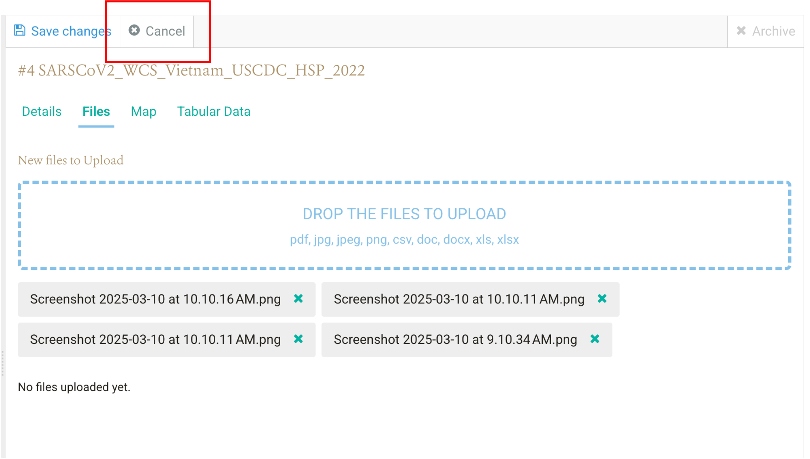{width=100%, fig-align=center}

## Cancelling the Addition of a File to a Data Unit

To cancel the addition of a specific file to a data unit,

* Find it in the list of files below the “Drop the Files to Upload” box and select the “X” or cancel button on the right of the file name (red frame in the image below):

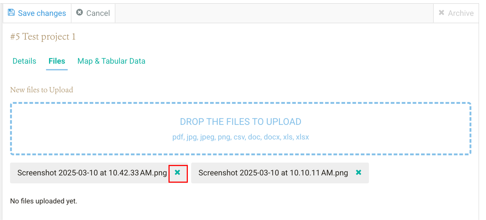{width=100%, fig-align=center}

The file will be removed from the list.

# Further Clustering Data Units in HAWK using Tags

It is possible that the design of a **Surveillance Activity** involves more spatial and temporal units than the ones available in HAWK between **Location** and **Event**. For example, a **Surveillance Activity** could involve the collection of samples from animals, the animals are within cages, the cages are within stalls, the stalls are within vendors, and the vendors are within markets, and markets are within cities. If the **Event** corresponds to the sampling of animals in a cage, its position (longitude/latitude) is the cage, and the **Location** is the market, then stalls, vendors, and cities still need to be taking into account. The solution in HAWK is to tag the existing units. Tags will allow to query data units and group them. In the example, **Events** can be tagged by stall and by vendor.  the **Location** could be. Moreover, the each **Event** and **Location** can be tagged with a season or any other grouping category.

Tags are available for **Surveillance Activities** up to **Diagnostic**. 

## Creating Tags

To create tags in HAWK, open a data unit (e.g., an **Event**) by selecting it under one of the corresponding folder (e.g., the "Event" folder) and click in the "Create New Tag" button on the top of the **Workspace Panel**. A pop-up window allows to name the tag and select if it is a spatial, temporal, or other type of tag. Then click "Create New Tag": 

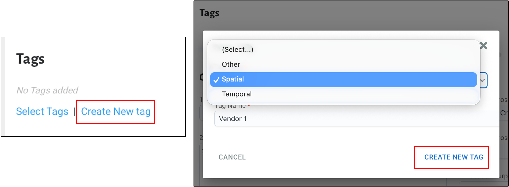{width=100%, fig-align=center}

To cancel the creation of a new tag, click the cancel button instead.

## Create Nested Tags

Nested tags can be added to an existing tag in order to categorize a unit (e.g. an **Event**) with more than one level, with each level having different groups. Following the market sample example above, an **Event** (the sampling of the animals in a cage) could be tagged by vendor and by the stall *within* the vendor. 

To create a nested tag, create the tag for the higher level first (in the example, the vendors) as explained in the section "Creating tags". Then find that tag under the "Select a tag" button on the top of the **Workspace Panel** and hover in the area to the right of the tag name until three blue icons appear: 

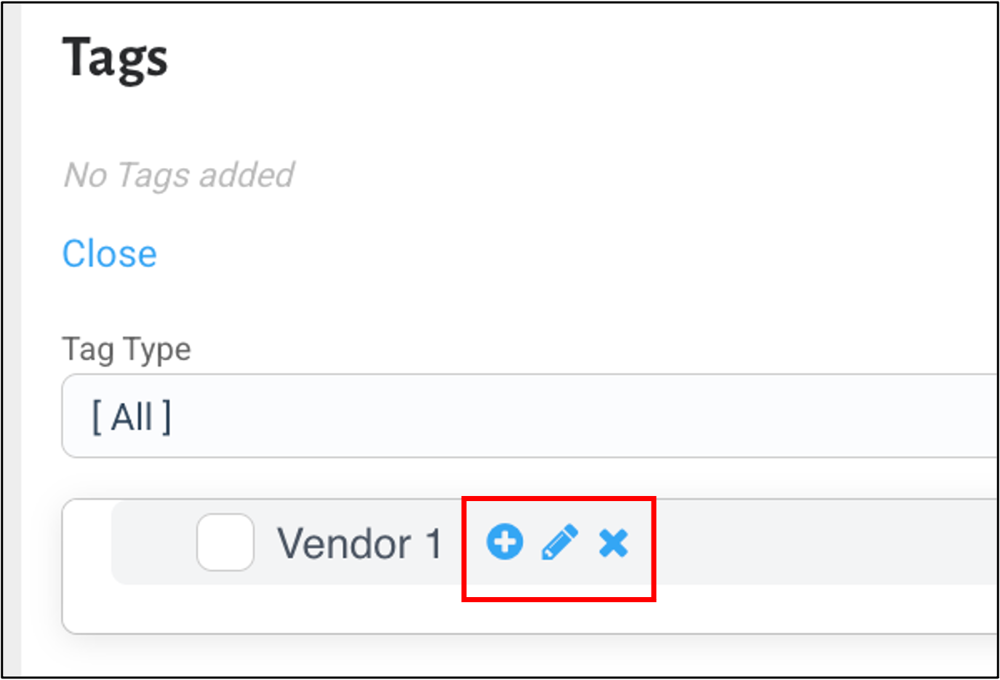{width=50%, fig-align=center}


These icons are to delete the current tag (X icon), to edit the current tag (pencil icon), and to add a nested tag (plus icon). Click on the plus icon and the system will allow you to name the nested tag. Then click "Create New Tag":

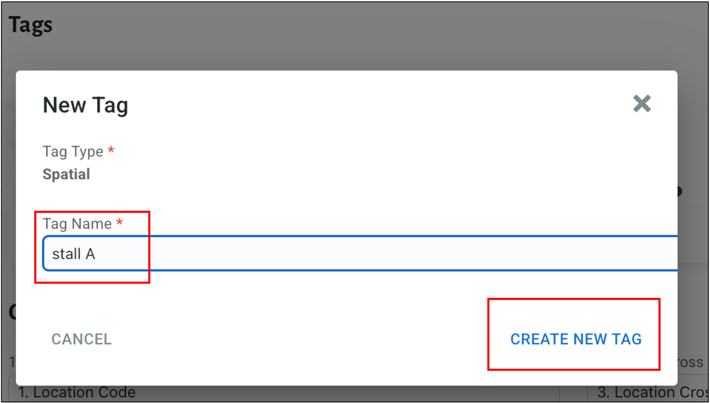{width=50%, fig-align=center}

The nested tags will be available after clicking on "Selecte Tags" in **Workspace Panel**:

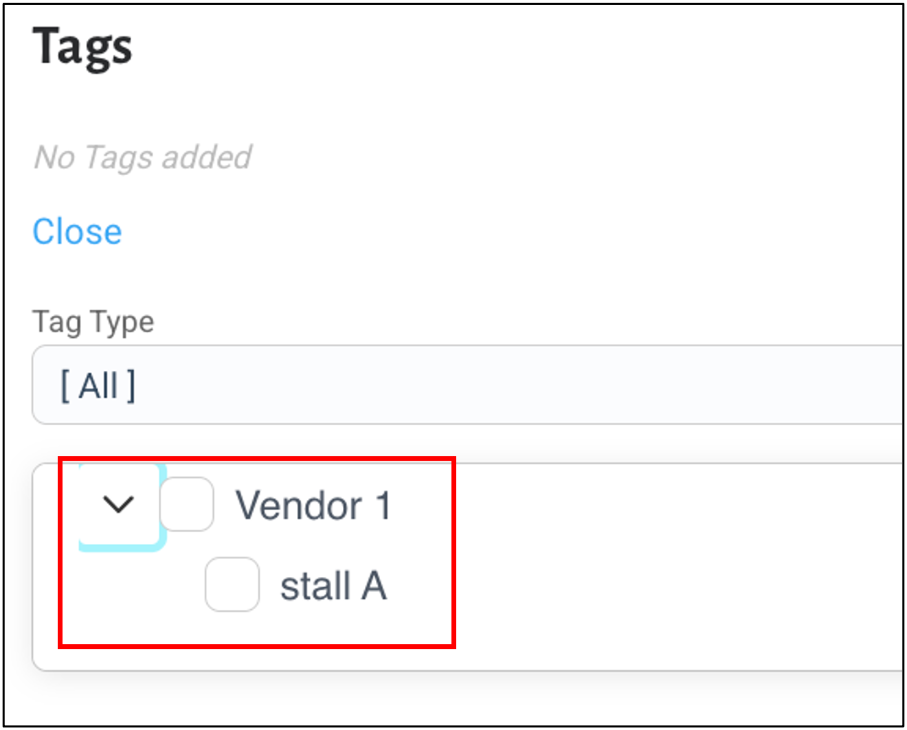{width=50%, fig-align=center}

To cancel the creation of a nested tag, click the cancel button instead.

## Adding Tags or Nested Tags

To add tags to a unit in HAWK, click in the "Select tags" button on the top of the **Workspace Panel**. The list of available tags will be displayed. To add a specific tag for the specific unit, click on the check box to the left of the chosen tag. The selected tag will be displayed under the "tags" header:

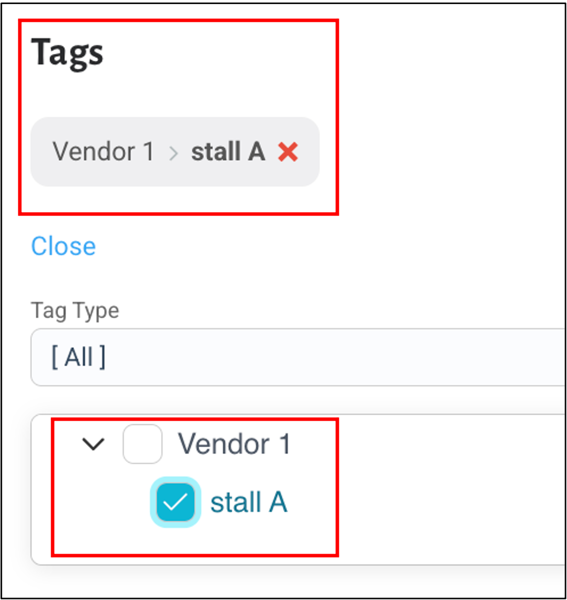{width=50%, fig-align=center}
Multiple tags can be added to the same unit.

To tag a unit using a set of nested tags, it is only necessary to click the check box of the lowest level tag. Selecting higher level tags will only add the selected tag and its parents but not the further nested tags.

## Edit Tags

To edit a tag find the tag to edit under the "Select a tag" button on the top of the **Workspace Panel** and hover in the area to the right of the tag name until three blue icons appear (see "Create Nested Tags" above). Click in the pencil icon to edit the tag and confirm the changes. 

## Delete Tags

To delete a tag find the tag to delete under the "Select a tag" button on the top of the **Workspace Panel** and hover in the area to the right of the tag name until three blue icons appear (see "Create Nested Tags" above). Click in the cross icon to delete the tag and confirm. Deleting a parent tag also deletes the tags nested under them.

<!-- ## Clustering Events -->

<!-- If **Events** are grouped in either spatial units, nested or non-nested, that are smaller than the corresponding **Locations**, or in temporal units, they can be assigned to **Clusters**.  The fields to add the **Event** to the corresponding **Clusters** will be active after reporting the grouping of **Events** in the corresponding **Surveillance Activity**: -->

<!-- To include an **Event** in nested spatial **Clusters** -->

<!-- To include an **Event** in a non-nested spatial **Clusters** -->

<!-- To include an **Event** in nested temporal **Clusters** -->

<!-- To include an **Event** in a non-nested temporal **Clusters** -->

<!-- ## Clustering Source Records -->

<!-- If **Source Records** are grouped in either spatial units, nested or non-nested, that are smaller than the corresponding **Event**, or in temporal units, they can be assigned to **Clusters**.  The fields to add the **Source Record** to the corresponding **Clusters** will be active after reporting the grouping of **Source Record** in the corresponding **Surveillance Activity**: -->

<!-- **Clusters** of **Source Records** can contain **Source Records** of any type. -->

<!-- To include a **Source Record** in nested spatial **Clusters** -->

<!-- To include a **Source Record** in a non-nested spatial **Clusters** -->

<!-- To include a **Source Record** in nested temporal **Clusters** -->

<!-- To include a **Source Record** in a non-nested temporal **Clusters** -->

# Viewing Data in HAWK

To view specific data, navigate through the data units in the **Navigation Panel** until finding the data unit of interest. View either the data unit fields, files, the contextual information, or the spatial distribution of a specific data unit in the “Map and Tabular Data” tab of the **Workspace Panel**.

# Quick Search 

To quickly search for a unit in HAWK, click on the magnifier icon on the top right corner of the **Navigation Panel**. 

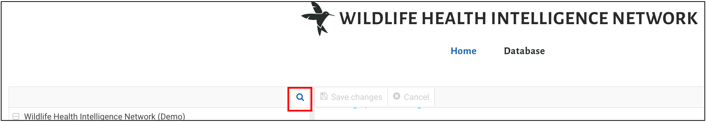{width=100%, fig-align=center}


A new window will pop-up. In this window there is a table to query units. Units can be searched using keywords written in the search bar. Results can be filtered by selecting a specific type of unit (**Surviellance Activity**, **Field Visits**, etc), a start date, or and end date for the period to search for. To go to a specific unit click on the cell in the second column containing the id of the unit of interest:


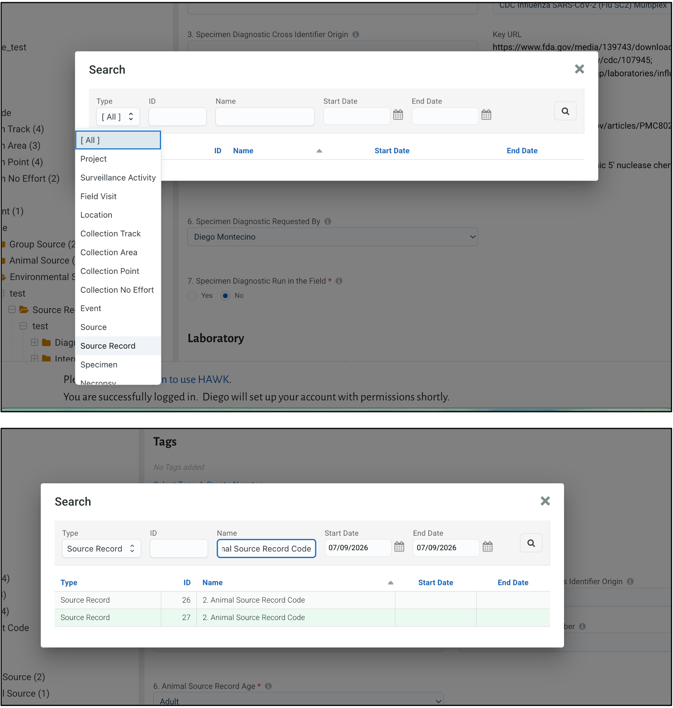{width=50%, fig-align=center}

# Editing Data in HAWK

## Editing a Data Unit

Editing permissions are needed to edit the fields of a data unit or modify its files. If the permission is active, then follow the instructions provided in section “Adding a New Data Unit in HAWK”. Once the edits are completed, select the “Save Changes” button on the top left of the **Navigation Panel**. Edits can be cancelled if the changes made have not been saved. To cancel follow the instructions provided in section “Cancelling the Addition of a Data Unit in HAWK”.

## Editing Files of a Data Unit

To add new or additional files to a data unit, follow the instructions provided in the section, “Adding Files to a Data Unit”. To cancel the addition of files, follow the instructions provided in the section “Cancelling the Addition of a File to a Data Unit in HAWK”. To delete files uploaded to a data unit, see the next section.

# Deleting Data in HAWK

## Deleting a Data Unit

To delete a data unit, navigate to the corresponding data unit and select it. The **Workspace Panel** has an “Archived” button on the top right corner (red frame in the image below):

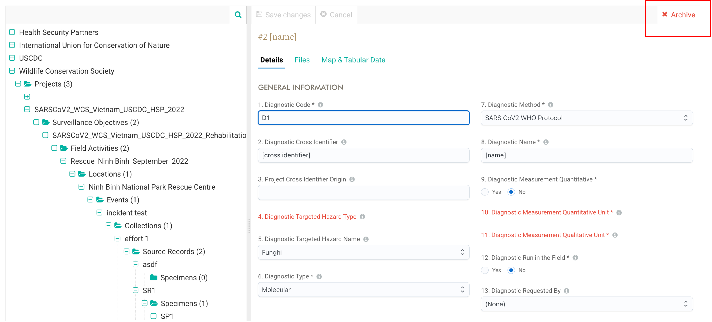{width=100%, fig-align=center}


To delete the data unit, select the “Archive” button. A window will pop-up to confirm the action to ‘Archive’ or to “Cancel & Close” the deletion of the data unit:

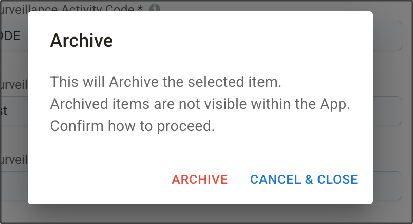{width=50%, fig-align=center}

Confirm the archiving of the data unit by selecting “Archive” or “Cancel & Close” to cancel the archiving of the data unit

## Deleting Files of a Data Unit

To delete files of a data unit, navigate to the corresponding data unit using the **Navigation Panel** and open. Then, open the “Files” tab in the **Workspace Panel** and find the “Uploaded Files”:

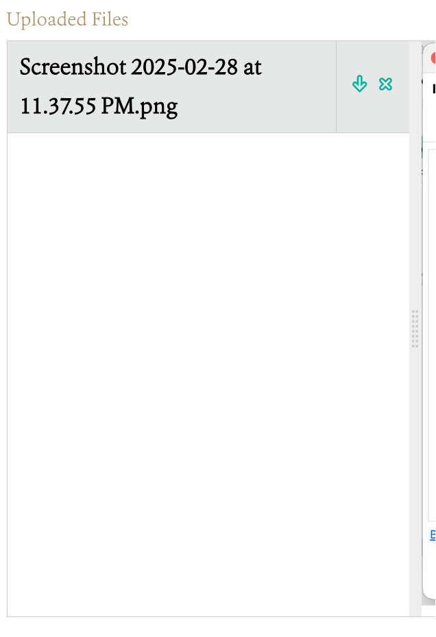{width=40%, fig-align=center}

To delete the file, select the “X” button to the right of the file name:

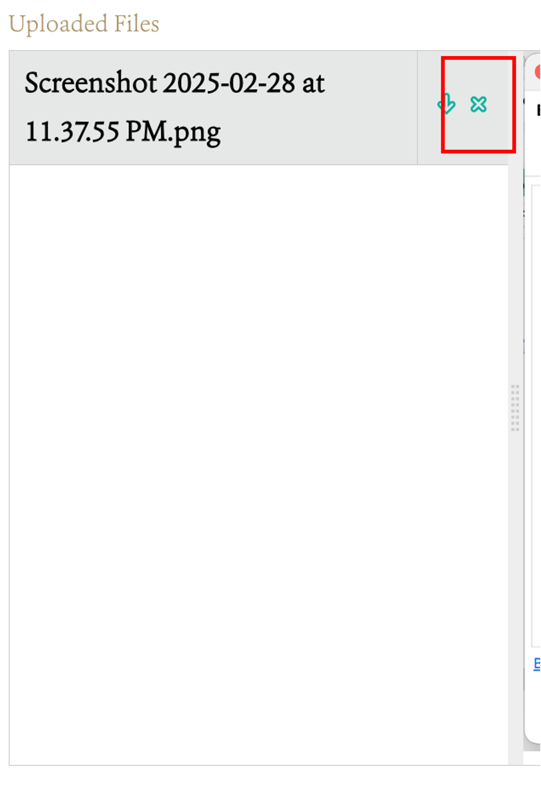{width=40%, fig-align=center}

A window will pop-up to confirm or cancel the deletion of the data unit. Confirm the deletion of the file by selecting “Delete” or “Cancel & Close” to cancel the deletion of the file:

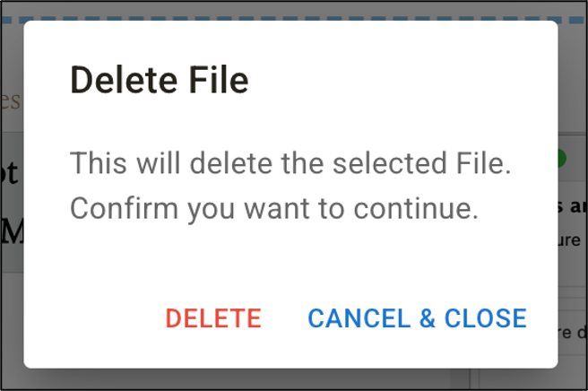{width=40%, fig-align=center}

# Exporting Data from HAWK (*under construction*)

<!-- ## Exporting Data Table -->

<!-- Data from archived data units are not exported. -->

## Downloading Files

Files associated with data units can be downloaded. To download files of data units, navigate to the corresponding data unit adn select it. Then, open the “Files” tab in the **Workspace Panel** and find the “Uploaded Files”.

To download a file, select the down arrow icon to the right of the file name:

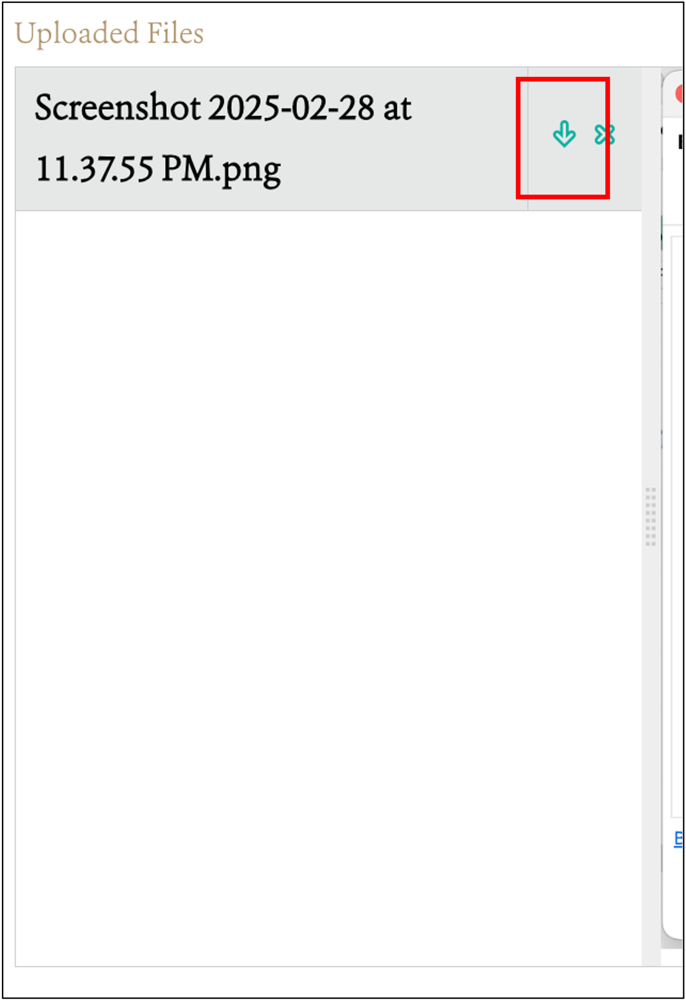{width=40%, fig-align=center}

A window to browse the download **Location** and name the file will pop-up.

<!-- # Closing an Organization Account (*under construction*) -->

<!-- Organization Accounts can be closed for two reasons: i) one of the Account Administrator requests the Organization Account to be closed or ii) the Organization Account has been inactive for four years. In the first case, the **General Administrators** of HAWK will reach the second Account Administrator, if any, to confirm the account closure. In the second case, the **General Administrators** of HAWK will try to reach the Account Administrators to confirm or cancel the closing of the account. -->

<!-- Data of closed accounts is archived and not deleted. Data from an Organization Account that is closed are embargoed following the details provided in the “FAIR and CARE” section below. -->

# Data Safety and Security (*under construction*)

<!-- * Data safety, security, and ownership are safeguarded through strict data compartmentalization across **Organization Accounts** administered by **Organization Administrators**. -->
<!-- * **Organization Administrators** access the **Organization** account after a two-factor authentication access process. -->
<!-- * **Organization Administrators** authorize **General Users** into **Organization** accounts. -->
<!-- * **General User** accounts are also independent and accessed after a two-factor authentication access process. -->
<!-- * **General Users** have different permissions granted by the **Organization Administrator** to view, edit, delete, and export data. These permissions are set by **Surveillance Activity**. -->
<!-- * All changes made in the data units (addition, edition, deletion, file uploading) are automatically documented in logs that are accessible by the corresponding **Organization Administrators**(see “**HAWK Administrator Account Manual**”). If needed, the data can be reverted to a previous state by following these logs. -->
<!-- * “Deleted” data is archived and not deleted from the system (not hard deletion). It is possible to restore data units. To accomplish the restoration, **Organization Administrators**need to contact HAWK **General Administrators** (see “**HAWK Administrator Account Manual**”). -->

<!-- Data is physically stored in (*under construction*). -->

<!-- Data in HAWK is under License X following the “**HAWK Organization Account Terms of Reference**” (*under construction*). -->

# FAIR and CARE Principles

## General Aspects

Beyond proper recording, annotation, and archival, HAWK promotes data stewardship, the notion of "long-term care" of valuable digital assets, with the goal that they should be discovered and re-used for downstream investigations, either alone, or in combination with newly generated data. The **FAIR** (Findability, Accessibility, Interoperability, and Reusability) Principles ([here](https://www.nature.com/articles/sdata201618)) are a guideline for those wishing to enhance the reusability of their data holdings. Table 2 summarizes how HAWK supports the FAIR Principles:


```{r table_2, message=FALSE, warning=FALSE, echo=FALSE}
#| tbl-cap: Table 2. Mapping of FAIR principles adapted from Wilkinson et al. to HAWK functionalities.

library(flextable)
library(tibble)

fair_table <- tribble(
  ~`FAIR Principle`, ~`FAIR Sub-Principle`, ~`How HAWK supports`,
  
  # Findable
  "To be Findable", "(Meta)data* are assigned a globally unique and persistent identifier", "Surveillance Activity system-based identifier and user-based code",
  "To be Findable", "Data are described with rich metadata", "Surveillance Activity extensive metadata",
  "To be Findable", "Metadata clearly and explicitly include the identifier of the data it describes", "HAWK complies with this sub-principle",
  "To be Findable", "(Meta)data are registered or indexed in a searchable resource", "Data and metadata can be searched in HAWK using the Surveillance Activity Identifier or the Code",
  
  # Accessible
  "To be Accessible", "(Meta)data are retrievable by their identifier using a standardized communications protocol", "HAWK supports this sub-principle",
  "To be Accessible", "The protocol is open, free, and universally implementable", "Yes, for Global South users without funding. API to be developed",
  "To be Accessible", "The protocol allows for an authentication and authorization procedure, where necessary", "HAWK complies with this sub-principle",
  "To be Accessible", "Metadata are accessible, even when the data are no longer available", "Yes, data is archived including its metadata",
  
  # Interoperable
  "To be Interoperable", "(Meta)data use a formal, accessible, shared, and broadly applicable language for knowledge representation.", 
  "Long term goal is to develop such language for wildlife health surveillance through the Wildlife Health Intelligence Network including an ontology",
  "To be Interoperable", "(Meta)data use vocabularies that follow FAIR principles", "Yes, the data dictionary is available online",
  "To be Interoperable", "(meta)data include qualified references to other (meta)data", "Yes, this is the goal of cross-identifier fields in HAWK data units",
  
  # Reusable
  "To be Reusable", "Meta(data) are richly described with a plurality of accurate and relevant attributes", 
  "Yes, as more metadata is provided at the Surveillance Activity level, it will be possible to identify and propose more accurate and relevant attributes",
  "To be Reusable", "(Meta)data are released with a clear and accessible data usage license", 
  "Yes, the metadata and data are accessible depending on their administrators. Data from closed accounts is available after embargo. The data license is established in the Surveillance Activity metadata",
  "To be Reusable", "(Meta)data are associated with detailed provenance", "HAWK keeps record of all data changes and archives deleted data",
  "To be Reusable", "(Meta)data meet domain-relevant community standards", "Metadata and data structure is supported by the Wildlife Health Intelligence Network"
)

  flextable(fair_table) |>
  merge_v(j="FAIR Principle") |>
  theme_box() |>
  width(j = "FAIR Sub-Principle", width=7, unit = "cm") |>
  width(j = "How HAWK supports", width=10, unit = "cm")


```


The **CARE** (Collective Benefit, Authority to Control, Responsibility, and Ethics) Principles for Indigenous Data Governance ([here](https://datascience.codata.org/articles/10.5334/dsj-2020-043)) are designed to complement the **FAIR** Principles and guide the inclusion of Indigenous Peoples in data processes that strengthen Indigenous control for improved discovery, access, use, reuse, and attribution in contemporary data landscapes. The **CARE** Principles (Table 3) are people and purpose-oriented, reflecting the crucial role of data in advancing Indigenous innovation and self-determination.


```{r table_3, message=FALSE, warning=FALSE, echo=FALSE}
#| tbl-cap: Table 3. Mapping of CARE principles adapted from Carroll et al. to HAWK functionalities.
#| 
# library(knitr)
# library(kableExtra)
library(tibble)
library(flextable)

care_table <- tribble(
  ~`CARE Principle`, ~`CARE Sub-Principle`, ~`How HAWK supports`,
  
  # Collective Benefit
  "Collective Benefit", "For inclusive development and innovation", "NA",
  "Collective Benefit", "For improved governance and citizen engagement", "NA",
  "Collective Benefit", "For equitable outcomes", "NA",
  
  # Authority to Control
  "Authority to Control", "Recognizing rights and interests", "NA",
  "Authority to Control", "Data for governance", 
  "Data in HAWK that are relevant to Indigenous People world views and empower self-determination and effective self-governance are available and accessible to Indigenous nations and communities by requiring database users to accept specific condition in the Terms of Use",
  "Authority to Control", "Governance of data", 
  "HAWK is free of cost for Indigenous Communities establishing their own *Organization Account*",

  # Responsibility
  "Responsibility", "For positive relationships", "NA",
  "Responsibility", "For expanding capability and capacity", 
  "HAWK is free of cost for Indigenous Communities establishing their own *Organization Account*",
  "Responsibility", "For Indigenous languages and worldviews", 
  "HAWK can be translated to any language",
  
  # Ethics
  "Ethics", "For minimizing harm and maximizing benefit", "NA",
  "Ethics", "For justice", "NA",
  "Ethics", "For future use", "Availability of Indigenous data in HAWK, controlled under an *Organization Account* of an Indigenous Community or Individual depends on the corresponding Organization Account administrators\n
  Indigenous data not administered by an Indigenous Community or Individual can only be shared with the authorization of the Indigenous community sourcing the data\n
  Indigenous data from closed Organization Accounts can be embargoed by the indigenous communities that generated or that sourced the data\n
  The embargo can only be lifted by the corresponding community to be available for specific individuals, groups, other communities, or the general public"
)

 flextable(care_table) |>
  merge_v(j="CARE Principle") |>
  theme_box() |>
  width(j = "CARE Sub-Principle", width=7, unit = "cm") |>
  width(j = "How HAWK supports", width=10, unit = "cm")

```


<!-- ## Specific Aspects (*under construction*) -->

<!-- **Organizations** share basic information about their **Surveillance Activities** in a public inventory on the HAWK website. The inventory contains the (objective, target species, study sites, the person responsible, and contact information. -->

<!-- Moreover, **Organizations** can decide to keep data of **Surveillance Activities**: -->

<!-- * Restricted to themselves -->
<!-- * Available to other selected individuals -->
<!-- * Publicly available -->

<!-- **Organization** data will remain archived if the corresponding **Organization Account** is closed (see “Closing an Organization Account” above). The corresponding data are embargoed according to agreed terms of the **Organization** or for a maximum of number of years. When the embargo is lifted, the **Surveillance Activities** will be available in public inventory on the HAWK website and data from these **Surveillance Activities** can be provided to interested parties upon request to **HAWK General Administrators**. Special conditions apply for human identification data, if any, and indigenous data following the conditions outlined above (Table 3). -->